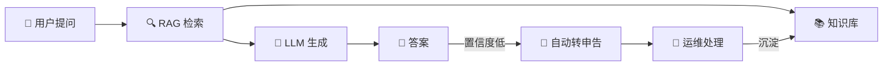
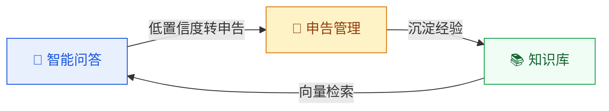
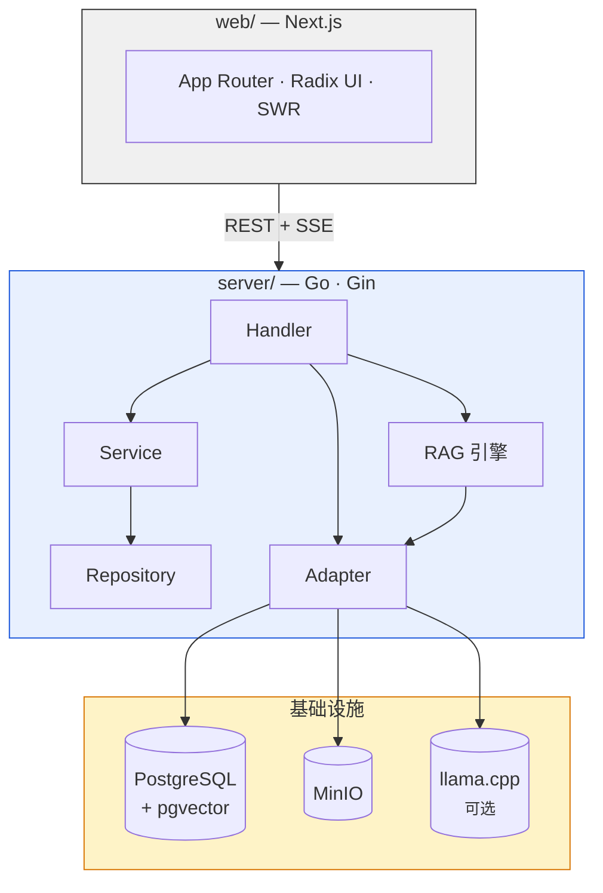
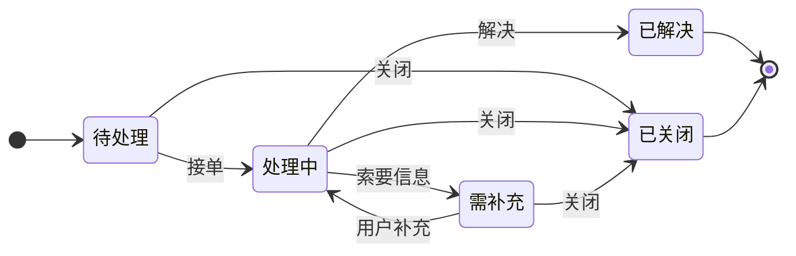

<p align="center">
  
</p>

<h1 align="center">OpsMind</h1>

<p align="center"><strong>私有部署的 AI 运维数字员工</strong><br>让每家企业拥有自己的智能运维助手</p>

<p align="center">
  <a href="https://github.com/int2t05/OpsMind/blob/main/LICENSE"></a>
  
  
  
  
</p>

---

## 这是什么？

企业运维团队每天被重复性咨询淹没——密码重置、权限申请、系统报障。这些工作消耗运维人员 40% 以上的时间，却无法沉淀为可复用的知识。

OpsMind 不是另一个 ChatGPT 套壳。它是一个**从检索管道到业务流程都自建**的运维数字员工系统：

- **自建 RAG 引擎** — BM25 + 向量混合检索 + RRF 融合 + 重排序，全程可控可审计
- **知识资产化** — 每次问答、每条申告处理记录都可转化为知识库文章，审核后发布
- **数据不出域** — 全部存储在自有 PostgreSQL + pgvector，支持本地 llama.cpp 推理



## 核心能力



| 🧠 智能问答 | 📚 知识管理 | 🎫 申告管理 | 🔐 权限看板 |
|:---|:---|:---|:---|
| 自建 7 步 RAG 管道 | 手动录入 / 文档上传 | 完整状态机流转 | JWT 双令牌 + RBAC |
| SSE 流式逐 token 输出 | 草稿→审核→发布→停用 | 站内消息实时通知 | 4 个预设角色，菜单动态渲染 |
| 失败自动降级，不中断 | 发布自动向量化到 pgvector | 7 天无操作自动关闭 | 实时统计卡片 + 趋势图 |
| 多轮对话 + 会话管理 | 支持 PDF · DOCX · MD · TXT | 处理记录 → 知识候选 | 敏感操作全量审计日志 |

## 架构



> RAG 引擎完全自建，不依赖 LangChain 或 LlamaIndex。BM25 算法纯 Go 实现，向量检索走 pgvector HNSW 索引 + halfvec 半精度。

## 快速开始

**前置条件：** Docker + Docker Compose v2 · 8 GB 内存 · 10 GB 磁盘

```bash
git clone https://github.com/int2t05/OpsMind.git && cd OpsMind
cp .env.example .env
# 编辑 .env：设置 JWT_SECRET（必填）和 LLM 配置
docker compose up -d --build
```

启动后：

| 服务 | 地址 |
|------|------|
| 前端 | http://localhost:3000 |
| 后端 API | http://localhost:8080 |

初始化数据库并加载种子数据：

```bash
docker compose exec -T postgres psql -U opsmind -d opsmind < server/migrations/init.sql     # DDL 增强（HNSW 索引）
docker compose exec -T postgres psql -U opsmind -d opsmind < server/migrations/seed_essential.sql  # 角色 + 用户 + LLM 配置
```

预置账号：

| 账号 | 密码 | 角色 |
|------|------|------|
| `admin` | `Admin@123` | 系统管理员 |
| `operator1` | `OpsMind@123` | 运维人员 |
| `knowledge` | `Knowledge@123` | 知识库管理员 |
| `reporter1` | `Reporter@123` | 报障人 |

### 本地 AI（可选）

```bash
# 下载 GGUF 模型到 ./models/ 目录 (~3 GB)
pip install huggingface_hub
huggingface-cli download bartowski/Qwen3-4B-Instruct-2507-GGUF --include "*Q4_K_M*" --local-dir ./models/
huggingface-cli download bartowski/Qwen3-Embedding-0.6B-GGUF --include "*Q8_0*" --local-dir ./models/
docker compose --profile ai-local up -d --build
```

| 模型 | 用途 | 大小 |
|------|------|------|
| Qwen3-4B-Q4_K_M | 对话（LLM） | ~2.4 GB |
| Qwen3-Embedding-0.6B-Q8_0 | 向量（Embedding） | ~0.6 GB |

> 也支持 OpenAI / DeepSeek 等任何 OpenAI-compatible API。LLM 与 Embedding 可独立配置不同服务商，热替换即时生效。

## 申告状态机



## 项目结构

```
OpsMind/
├── server/                  # Go 后端（Gin + GORM）
│   ├── internal/
│   │   ├── handler/         # HTTP Handler（11 个 API 域）
│   │   ├── service/         # 业务逻辑 + 状态机
│   │   ├── rag/             # 自建 RAG 引擎（12 个模块）
│   │   ├── adapter/         # LLM / Embedding / pgvector / MinIO
│   │   └── middleware/      # JWT / RBAC / CORS
│   ├── migrations/          # DDL + 种子数据
│   └── tests/               # Go 集成测试
├── web/                     # Next.js 前端
│   └── src/
│       ├── app/             # App Router（portal / admin）
│       ├── components/      # UI 组件 + 布局
│       └── lib/api/         # API 客户端
├── docs/                    # PRD / TECH / API 文档
├── test/                    # 验收测试文档与数据
└── docker-compose.yml
```

## 文档

| 文档 | 说明 |
|------|------|
| [PRD](docs/PRD.md) | 产品需求 — 功能定义、业务规则 |
| [TECH](docs/TECH.md) | 技术架构 — 分层设计、DDL、ADR |
| [API](docs/API/README.md) | 9 份接口文档，覆盖全部端点 |
| [测试流程](test/README.md) | 验收测试 — 9 大场景、完整步骤 |

## 贡献

欢迎提交 Issue 和 PR。

1. 确保通过现有测试
2. 遵循项目代码风格和注释规范
3. API 变更同步更新 `docs/API/`

## 许可证

[MIT](LICENSE)
