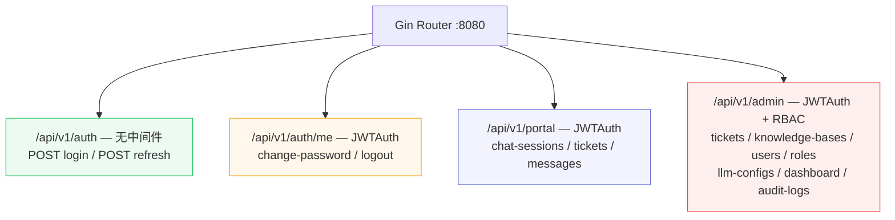

# 业务流程文档

> 覆盖 OpsMind 全部业务模块的端到端数据流，含 Mermaid 流程图与详细调用链。

## 路由总览

## 文档索引

| 文档 | 业务模块 | 核心调用链 |
|------|---------|-----------|
| [auth-flow.md](auth-flow.md) | 认证与中间件 | Login → JWT 双令牌 → Refresh → RBAC 中间件链 |
| [chat-rag-sse-flow.md](chat-rag-sse-flow.md) | 智能问答 | StreamChat → Pipeline.Execute → SSE 流式 → 持久化 |
| [knowledge-publish-flow.md](knowledge-publish-flow.md) | 知识管理 | KB CRUD → 文章状态机 → 文档上传 → 异步处理 → 发布管道 |
| [ticket-lifecycle-flow.md](ticket-lifecycle-flow.md) | 申告管理 | CreateTicket → UpdateStatus 状态机 → Supplement → AutoClose |
| [user-rbac-flow.md](user-rbac-flow.md) | 用户与权限 | 用户 CRUD → 角色管理 → 菜单树 → 权限校验 |
| [llm-config-hot-reload-flow.md](llm-config-hot-reload-flow.md) | LLM 配置 | CRUD → atomic.Value 热替换 → 连接测试 |
| [admin-ops-flow.md](admin-ops-flow.md) | 看板与审计 | Dashboard 统计 → 趋势分析 → 审计日志 → 系统配置 |
