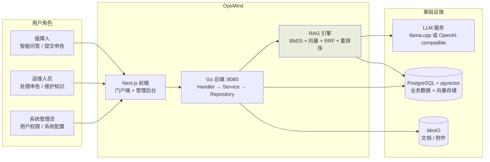
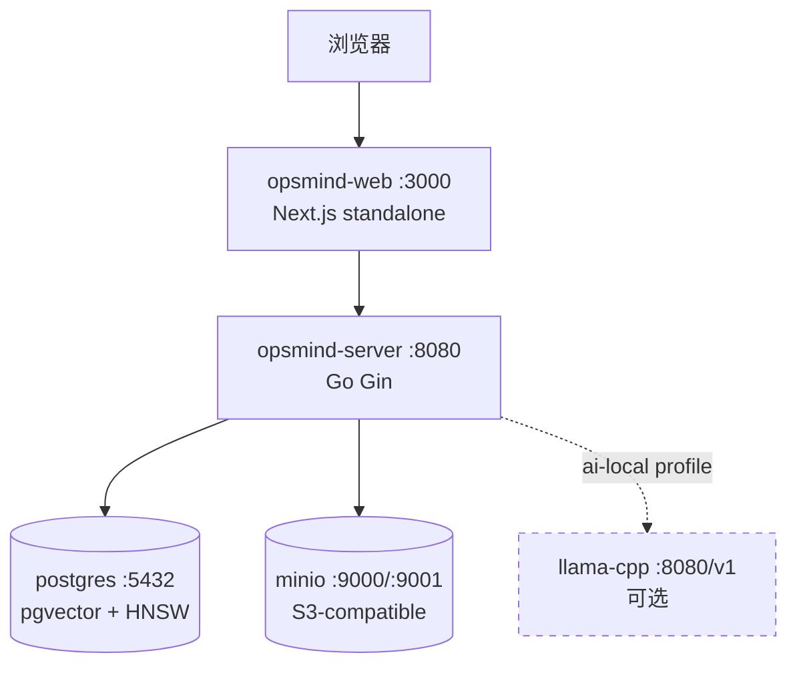
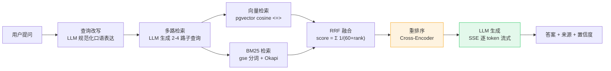
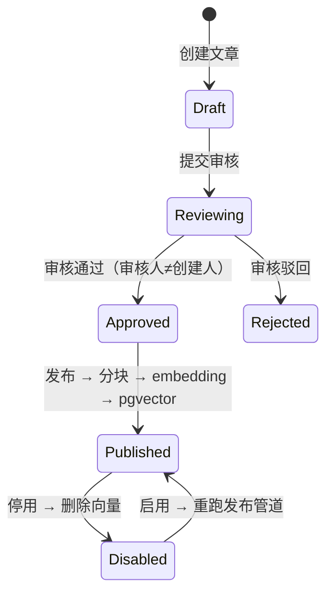
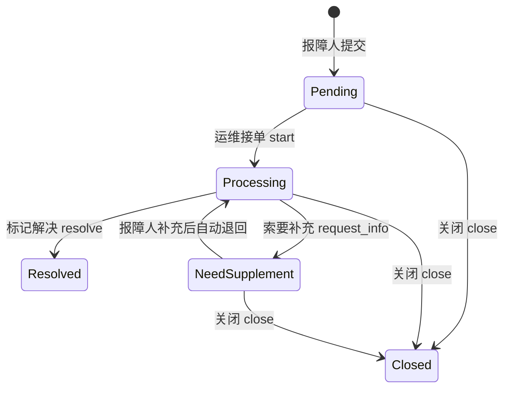
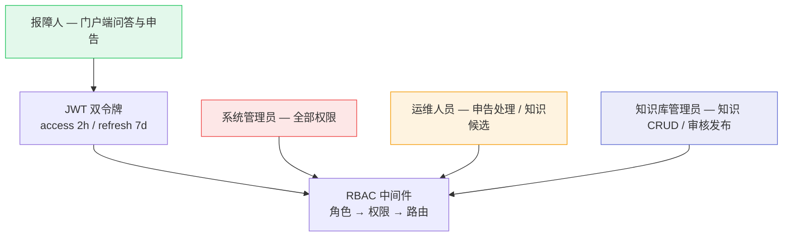

# OpsMind — 产品需求文档

> 私有部署的 AI 运维数字员工系统。关联文档：[TECH](TECH.md) · [API](API/README.md) · [FLOW](FLOW/README.md)

## 1. 产品定位

面向企业运维场景的 AI 数字员工，通过私有知识库 + 自建 RAG 引擎 + 申告全流程管理，替代或辅助人工完成咨询、自助处理、工单流转和知识沉淀。数据不出域，全部存储在自有 PostgreSQL + pgvector。

## 2. 系统上下文

## 3. 部署拓扑

## 4. 核心功能

### 4.1 智能问答

- 全管道 7 步骤可独立开关，非核心步骤失败降级不阻塞
- 向量检索与 LLM 生成失败返回明确错误码（20002 / 20001）
- 置信度三级：高（≥0.8）/ 中（≥0.6）/ 低（<0.6），低置信度引导提交申告
- SSE 事件类型：step / token / error / done

### 4.2 知识库管理

- 文档上传支持 PDF/DOCX/MD/TXT（上限 50MB），异步解析入库
- 发布管道：Chunker(1000/200) → Embedder(batch=32) → pgvector halfvec → 先写后删替换旧向量
- 删除知识库级联清理文章和向量

### 4.3 申告管理

- 状态机显式校验前置状态，补充信息上限 3 次
- 调度器每小时扫描，自动关闭超过 7 天的未完结申告
- CAS 防并发：`UPDATE WHERE id=? AND status=?`
- 编号格式：TK-YYYYMMDD-XXXX

### 4.4 用户与权限

- 密码策略：`^(?=.*[a-z])(?=.*[A-Z])(?=.*\d).{8,32}$`，bcrypt cost=10
- 菜单-权限-路由三级绑定，`/admin/*` 强制 RBAC 校验

### 4.5 LLM 配置

- 双模式：llama.cpp 本地推理 / OpenAI-compatible 远程 API
- `atomic.Value` 热替换：修改默认配置即时生效，无需重启
- API Key AES-GCM 加密存储，JSON 序列化自动脱敏（`sk-****cret`）

### 4.6 数据看板与审计

- 实时统计 7 项指标：今日申告 / 待处理 / 处理中 / 已解决 / 今日问答 / 平均置信度 / 知识条目
- 趋势图：日粒度申告量 + 问答量
- 审计日志：按操作人 / 操作类型 / 日期筛选，记录所有管理操作

## 5. 技术选型

| 层 | 技术 |
|----|------|
| 后端框架 | Go 1.26 + Gin + GORM |
| 数据库 | PostgreSQL 18 + pgvector (halfvec + HNSW) |
| 对象存储 | MinIO (S3-compatible) |
| 前端 | Next.js 16 + React 19 + TypeScript + Tailwind CSS 4 |
| UI | Radix UI + Lucide Icons + SWR |
| LLM/Embedding | llama.cpp server 或 OpenAI-compatible API |
| 中文分词 | gse（纯 Go，无 CGO） |
| 部署 | Docker Compose（4 必须服务 + 1 可选 ai-local profile） |

## 6. API 概览

统一响应信封：`{"code":0,"message":"success","data":{}}`

| 路由组 | 前缀 | 认证 |
|--------|------|------|
| 公开 | `/api/v1/auth` | 无 |
| 门户 | `/api/v1/portal` | JWT |
| 管理 | `/api/v1/admin` | JWT + RBAC |

> 详细接口定义见 [API 文档](API/README.md)，业务数据流见 [FLOW 文档](FLOW/README.md)。
