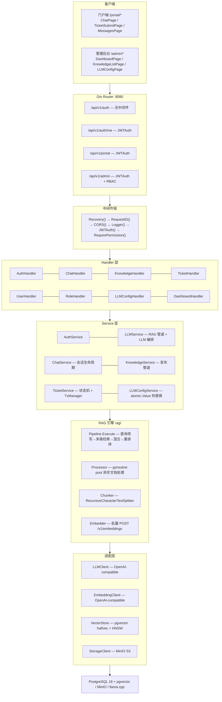
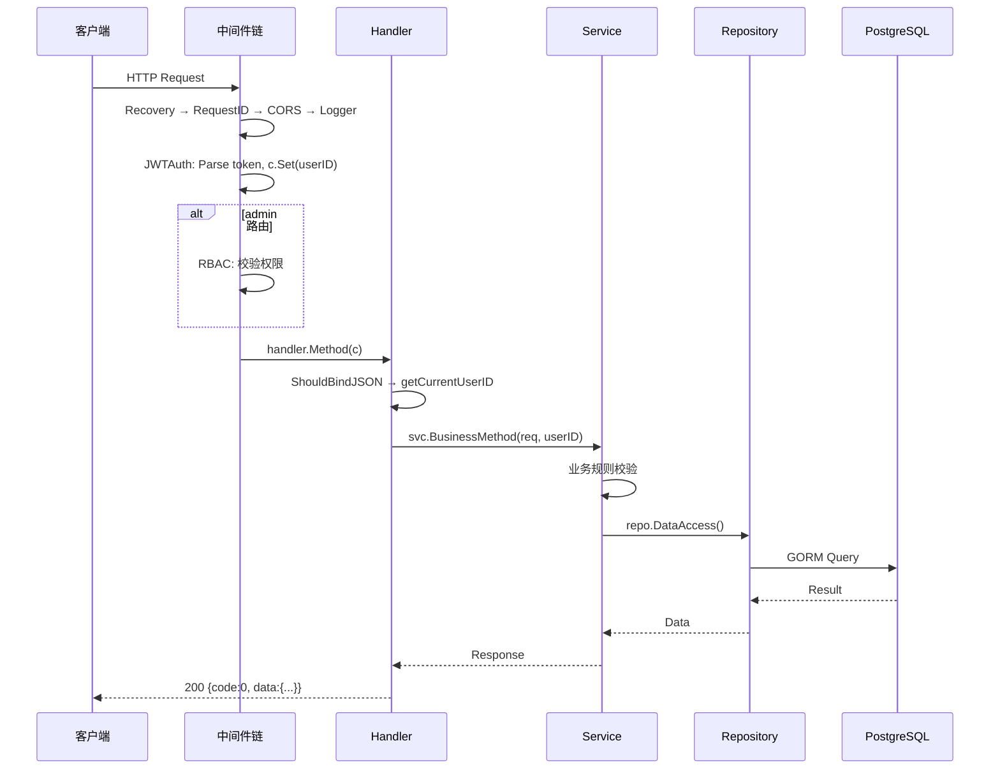
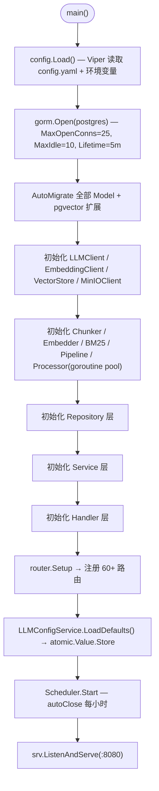
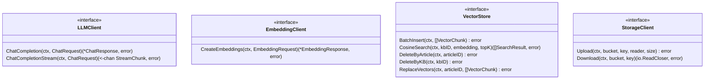
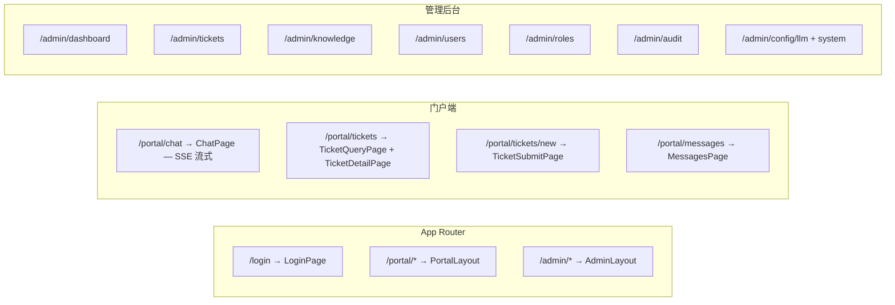
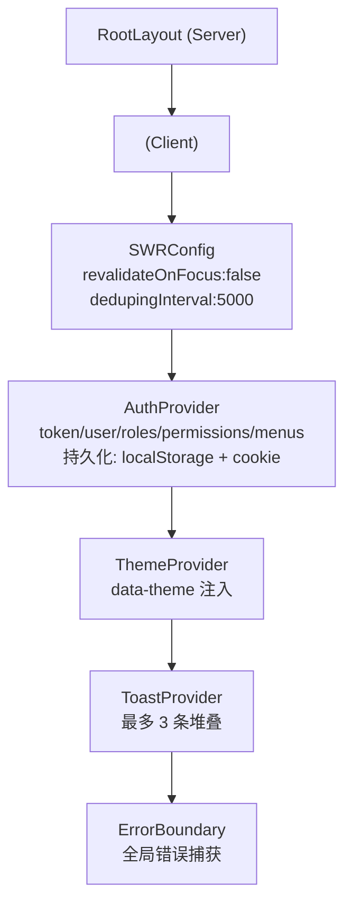
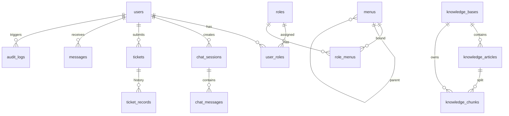
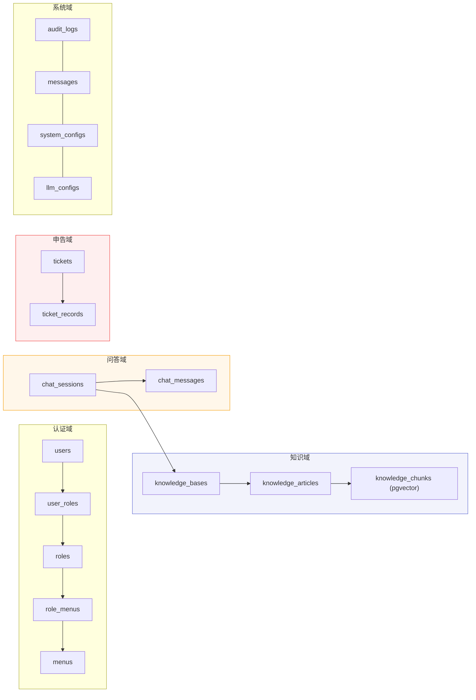
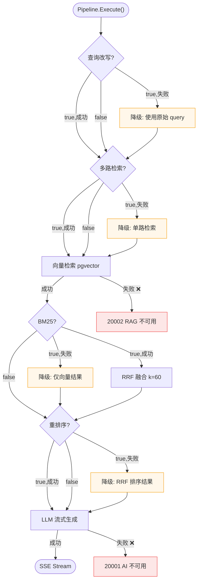
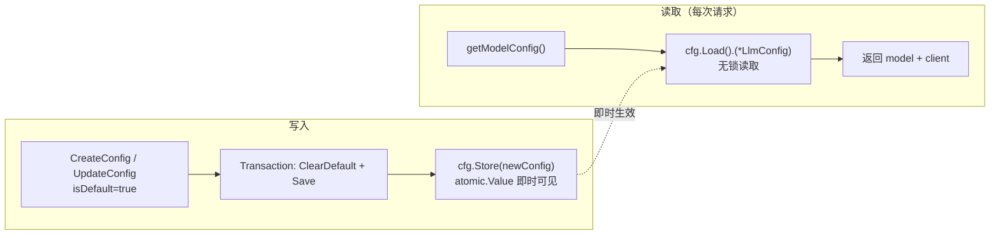

# OpsMind — 技术架构文档

> 覆盖系统架构、前后端分层设计、数据库、可靠性、设计系统。关联文档：[PRD](PRD.md) · [TODO](TODO.md) · [API](API/README.md) · [FLOW](FLOW/README.md)

## 1. 系统架构

### 1.1 分层架构



### 1.2 请求生命周期



### 1.3 启动流程



## 2. 后端架构

### 2.1 三层分离

| 层 | 职责 | 禁止 |
|----|------|------|
| Handler | 参数绑定、调用 Service、响应格式化 | 不含业务逻辑 |
| Service | 业务规则、事务编排、调用 Repo/Adapter | 不含 SQL |
| Repository | 数据访问、GORM 查询 | 不含业务规则 |

Handler 层共享工具：`parsePagination` / `parseID` / `getCurrentUserID` / `safeHandler`（消除 nil 检查样板）。

### 2.2 RAG 引擎

12 个文件组成自包含领域引擎，不依赖 HTTP 层：

| 文件 | 职责 |
|------|------|
| `pipeline.go` | 管道编排：`Execute(ctx, query, kbID, opts, onStep)` |
| `query_rewrite.go` | LLM 查询改写 |
| `multi_route.go` | LLM 多路检索路由 |
| `hybrid.go` | RRF 融合：`score = Σ 1/(60+rank_i)` |
| `bm25.go` | Okapi BM25 (k1=1.5, b=0.75) + gse 中文分词 |
| `rerank.go` | Cross-Encoder 重排序（子进程模式） |
| `chunker.go` | RecursiveCharacterTextSplitter (1000/200) |
| `embedder.go` | 批量 Embedding (batch=32) |
| `retriever.go` | 向量检索入口 |
| `processor.go` | goroutine pool 异步文档处理 |
| `document_parser.go` | PDF/DOCX/MD/TXT 解析 |
| `types.go` | 共享类型定义 |

### 2.3 适配层接口



- `LLMClient` / `EmbeddingClient`：OpenAI-compatible 实现，指数退避重试（maxRetries=3，429/503 可重试）
- `VectorStore`：pgvector 实现，halfvec 半精度 + HNSW 索引，维度一致性校验
- `StorageClient`：MinIO 实现，两桶模型（`opsmind-documents` 临时 + `opsmind-published` 已发布）

## 3. 前端架构

### 3.1 路由映射



### 3.2 组件分类

**Server Components（无 `'use client'`）：** RootLayout、NotFound、各 Layout 壳、AppleButton、AppleCard、AppleBadge、AppleSpinner

**Client Components（`'use client'`）：** 全部 Page 组件、AdminLayout、PortalLayout、AppleDialog、AppleInput/Textarea、ChatInput、ChatMessage、ChatPipeline、ConfirmDialog、StatusBadge、StatCard、ErrorBoundary

### 3.3 状态管理



- AuthProvider 使用 `useLayoutEffect` 设置 token getter，确保 SWR 首次请求携带 token
- 客户端 fetch 直连后端（`NEXT_PUBLIC_API_URL`），绕过 Next.js rewrite 避免 Turbopack POST 代理 500

### 3.4 API 模块速查

| 前端模块 | 核心函数 | 后端端点 |
|---------|---------|---------|
| `lib/api/auth.ts` | login / refreshToken / changePassword / logout | `/api/v1/auth/*` |
| `lib/api/chat.ts` | createSession / getSessionList / deleteSession / submitFeedback | `/api/v1/portal/chat-sessions/*` |
| `lib/api/knowledge.ts` | getKBList / createKB / getArticleList / publishArticle / uploadDocuments | `/api/v1/admin/knowledge-bases/*` |
| `lib/api/ticket.ts` | createTicket / getMyTickets / supplementTicket / updateTicketStatus | `/api/v1/portal/tickets/*` `/api/v1/admin/tickets/*` |
| `lib/api/user.ts` | getUserList / createUser / freezeUser | `/api/v1/admin/users/*` |
| `lib/api/role.ts` | getRoleList / createRole / updateRoleMenus / getMenus | `/api/v1/admin/roles/*` `/api/v1/admin/menus` |
| `lib/api/llm_config.ts` | getLLMConfigs / createLLMConfig / testLLMConnection | `/api/v1/admin/llm-configs/*` |
| `lib/api/dashboard.ts` | getStats / getTrends | `/api/v1/admin/dashboard/*` |
| `lib/api/audit.ts` | getAuditLogs | `/api/v1/admin/audit-logs` |
| `lib/api/message.ts` | getMessages / markAsRead / getUnreadCount | `/api/v1/portal/messages/*` |
| `lib/api/config.ts` | getConfig / setConfig / getAllConfigs | `/api/v1/admin/configs/*` |

### 3.5 关键 Hooks

| Hook | 用途 |
|------|------|
| `useAuth()` | 全局认证（login/logout/hasPermission），React Context |
| `useTheme()` | 双主题切换（light/dark），localStorage + cookie + data-theme |
| `useToast()` | Toast 通知，分级消失时间 |
| `useChatStream()` | SSE 流式问答状态管理，ReadableStream 解析 + AbortController |
| `useDebounce()` | 搜索防抖，300ms 默认 |
| `useUnreadCount()` | 消息未读数轮询，30s 间隔 |

## 4. 数据库设计

### 4.1 ER 关系



### 4.2 pgvector 配置

| 参数 | 值 | 说明 |
|------|-----|------|
| 向量类型 | `halfvec(1024)` | 半精度，维度可配置 |
| 索引 | HNSW | `halfvec_ip_ops`，内积算子 |
| 距离算子 | `<=>` | 余弦距离 |
| 分块大小 | 1000 字符 | 重叠 200 字符 |

### 4.3 关键索引

| 表 | 索引 | 用途 |
|----|------|------|
| `knowledge_chunks` | HNSW `embedding halfvec_ip_ops` | 向量相似度检索 |
| `knowledge_chunks` | B-tree `kb_id` + `article_id` | 按范围过滤/删除 |
| `tickets` | UNIQUE `ticket_no` | 编号唯一 |
| `tickets` | B-tree `user_id, status, created_at` | 列表查询 + AutoClose |
| `chat_sessions` | B-tree `user_id, created_at` | 会话列表 |

### 4.4 业务域划分



## 5. 可靠性设计

### 5.1 RAG 管道降级矩阵



核心原则：非核心步骤失败降级不阻塞。向量检索和 LLM 生成是核心路径，失败返回明确错误码。

### 5.2 置信度评分

三层次设计：

| 层次 | 计算方式 | 用途 |
|------|---------|------|
| Chunk Score | pgvector `<=>` 距离归一化 | 单块相关性 |
| Conf_raw | `α × S_retrieval + (1-α) × S_qa` | 综合评分 |
| 置信等级 | P30/P70 分位数阈值 | 前端展示 |

- `S_retrieval`：Top-K chunk 得分加权聚合
- `S_qa`：问题-答案 embedding 余弦相似度校验
- 阈值通过分位数动态计算（P30/P70），带完整性检查（P30≥0.3, P70≥0.6 不满足则回退硬编码）

### 5.3 外部服务重试策略

| 服务 | 重试 | 策略 | 关键保护 |
|------|------|------|---------|
| LLM API | 3 次 | 指数退避，仅 429/503 | 超时 120s |
| Embedding API | 3 次 | 指数退避，连接/超时始终重试 | batch=32 分批 |
| Reranker 子进程 | 自动重启 | 崩溃后 3s 重连 | 内部 30s 超时 |
| pgvector | 无 | 瞬时故障返回 20002 | HNSW 索引 |
| MinIO | 无 | 惰性检查 | io.LimitReader(100MB) |

### 5.4 并发安全

- `llmClient` 指针：`sync.Mutex` 保护读写，通过 `getLLMClient()` 访问
- 申告状态更新：CAS `UPDATE WHERE id=? AND status=?` 防并发覆盖
- Processor goroutine pool：`stopped` 原子标志 + channel 关闭幂等
- BM25 索引构建：`building` 原子标志 + defer recover 防 panic 残留

## 6. 配置与环境

### 6.1 环境变量（核心）

| 变量 | 说明 | 默认值 |
|------|------|--------|
| `POSTGRES_PASSWORD` | 数据库密码 | opsmind_dev |
| `JWT_SECRET` | JWT 签名密钥 | 需手动设置 |
| `LLM_BASE_URL` | LLM API 地址 | http://llama-cpp:8080/v1 |
| `LLM_API_KEY` | API 密钥（OpenAI 需要） | — |
| `LLM_MODEL` | LLM 模型名称 | qwen3-4b |
| `LLM_MAX_TOKENS` | 最大生成 Token | 8192 |
| `EMBEDDING_MODEL` | Embedding 模型 | bge-m3 |
| `EMBEDDING_DIMENSION` | 向量维度 | 1024 |
| `MINIO_ROOT_USER` / `MINIO_ROOT_PASSWORD` | MinIO 凭证 | minioadmin |
| `AI_CONFIDENCE_THRESHOLD` | 置信度阈值 | 0.6 |
| `AI_DEFAULT_TOP_K` | 默认检索 TopK | 5 |

> 完整 28 项环境变量见 `.env.example` 和 `docker-compose.yml`。

### 6.2 LLM 配置热替换



## 7. 设计系统

### 7.1 色彩

| 令牌 | 色值 | 用途 |
|------|------|------|
| Action Blue | `#0066cc` | 唯一品牌色，pill 按钮 |
| Focus Blue | `#2997ff` | 聚焦环 |
| Surface White | `#f5f5f7` | 浅色背景 |
| Surface Dark | `#1d1d1f` | 暗色背景 |
| Ink | `#1d1d1f` / `#f5f5f7` | 浅/暗主题正文字 |
| Ink Muted | `rgba(0,0,0,0.48)` | 辅助文字 |
| Hairline | `rgba(0,0,0,0.08)` | 分隔线 |

### 7.2 字体与圆角

- 字体：Inter Variable，正文字号 17px，标题 28px/20px，辅助 13px
- 按钮：完全圆角 pill（`9999px`）
- 卡片：`18px` 圆角，无边框，微阴影（`0 1px 3px rgba(0,0,0,0.04)`）
- 输入框：`12px` 圆角，hairline 边框

### 7.3 核心组件

| 组件 | 特征 |
|------|------|
| AppleButton | 4 变体：pill（蓝底白字）/ ghost（透明）/ utility（灰底）/ pearl（白底灰框） |
| AppleCard | 白底 + hairline 边框 + 12px 圆角，可选 hover 可点击 |
| AppleInput | 标准输入 + pill 搜索变体，forwardRef |
| AppleTable | 泛型 `<T>`，loading/empty 状态内置 |
| ApplePagination | 页码 + pageSize 选择器 |
| AppleDialog | Radix Dialog 封装，Apple 风格 |

## 8. 错误码

| 错误码 | HTTP | 说明 |
|--------|------|------|
| 0 | 200 | 成功 |
| 10001 | 401 | 未登录或令牌过期 |
| 10002 | 403 | 无权限 |
| 10003 | 400 | 参数校验失败 |
| 10004 | 404 | 资源不存在 |
| 10005 | 409 | 资源冲突 |
| 10006 | 400 | 用户已冻结 |
| 10007 | 400 | 用户已正常 |
| 20001 | 503 | AI 服务不可用 |
| 20002 | 503 | RAG 服务不可用 |
| 20003 | 503 | 存储服务不可用 |
| 99999 | 500 | 内部错误 |

## 9. 项目结构

```
server/cmd/main.go           入口：配置→DB→RAG→Service→Handler→Router→Scheduler
server/internal/
├── config/                   Viper 配置
├── middleware/               JWT / RBAC / CORS / Logger
├── router/                   路由注册 + safeHandler
├── handler/                  11 个 Handler
├── service/                  11 个 Service + scheduler + tx_manager
├── repository/               9 个 Repository
├── model/                    GORM 模型 + 枚举
├── rag/                      自建 RAG 引擎（12 文件）
├── adapter/                  LLM / Embedding / VectorStore / StorageClient
├── dto/                      request/ + response/
server/pkg/                   jwt / hash / response / errcode
web/src/
├── app/                      Next.js App Router（login/portal/admin）
├── components/ui/            Apple Design 组件
├── components/layout/        AdminLayout / PortalLayout
├── components/shared/        StatusBadge / ConfirmDialog / StatCard
├── components/chat/          ChatInput / ChatMessage / ChatPipeline
├── lib/api/                  10 个 API 客户端模块
├── hooks/                    6 个自定义 Hooks
└── styles/                   Apple Design Tokens + 双主题 CSS
```
