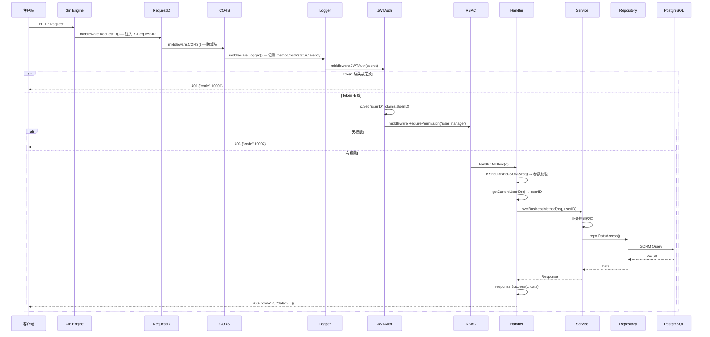
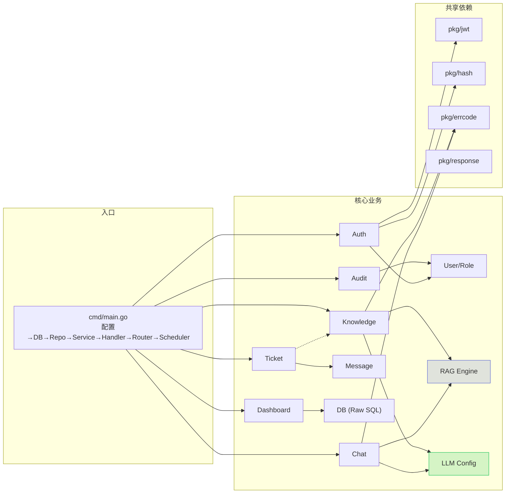

# 系统架构总览

> 基于当前代码实际结构绘制。最后更新：2026-06-12

## 1. 分层架构全景

```mermaid
flowchart TB
    subgraph Client["客户端层"]
        Browser["浏览器 (Vue 3 + Naive UI)"]
        Portal["门户端 /portal/*<br/>Chat.vue / TicketSubmit.vue / Messages.vue"]
        Admin["后台管理 /admin/*<br/>Dashboard.vue / KnowledgeList.vue / TicketList.vue / LLMConfig.vue"]
    end

    subgraph Router["Gin Router :8080"]
        Health["GET /health → 无认证"]
        Public["/api/v1/auth → 无中间件<br/>POST login / POST refresh"]
        JWTGroup["/api/v1/auth → JWTAuth<br/>POST /me/change-password / POST /me/logout"]
        PortalGroup["/api/v1/portal → JWTAuth<br/>chat-sessions / tickets / messages"]
        AdminGroup["/api/v1/admin → JWTAuth + RBAC<br/>tickets / knowledge-bases / users / roles / llm-configs / dashboard / audit-logs"]
    end

    subgraph MW["中间件链 middleware/"]
        direction LR
        RID["RequestID()"]
        CORS["CORS()"]
        Logger["Logger()"]
        Recovery["Recovery()"]
        JWTAuth["JWTAuth(secret)"]
        RBAC["RequirePermission(perm)"]
    end

    subgraph Handler["Handler 层 handler/"]
        AH["AuthHandler<br/>Login / Refresh / ChangePassword / Logout"]
        CH["ChatHandler<br/>CreateChatSession / StreamChatSession / SubmitFeedback"]
        KH["KnowledgeHandler<br/>CreateKB / CreateArticle / Publish / UploadDocuments"]
        TH["TicketHandler<br/>CreateTicket / UpdateStatus / AddRecord"]
        UH["UserHandler<br/>Create / Freeze / Unfreeze"]
        RH["RoleHandler<br/>Create / UpdateRoleMenus"]
        LRH["LLMConfigHandler<br/>CreateConfig / TestConnection"]
        DH["DashboardHandler<br/>GetStats / GetTrends"]
        AuH["AuditHandler<br/>List"]
    end

    subgraph Service["Service 层 service/"]
        AuthSvc["AuthService<br/>Login / RefreshToken"]
        ChatSvc["ChatService<br/>CreateChatSession → pipeline.Execute + llmClient.ChatCompletion"]
        KnowledgeSvc["KnowledgeService<br/>Publish → chunker.Split + embedder.Embed + store.BatchInsert"]
        TicketSvc["TicketService<br/>UpdateStatus → 状态机校验"]
        UserSvc["UserService / RoleService"]
        LLMSvc["LLMConfigService<br/>atomic.Value 热替换"]
        DashboardSvc["DashboardService<br/>原始 SQL 聚合查询"]
        AuditSvc["AuditService<br/>分页 + 批量姓名查询"]
    end

    subgraph RAG["RAG 引擎 rag/"]
        Pipeline["Pipeline.Execute()<br/>QueryRewrite → MultiRoute → VectorRetrieve<br/>→ BM25Retrieve → HybridFuse → Rerank"]
        Processor["Processor.Submit()<br/>goroutine pool 异步文档处理"]
        Chunker["Chunker.Split()<br/>RecursiveCharacterTextSplitter"]
        Embedder["Embedder.Embed()<br/>批量 /v1/embeddings"]
        BM25["BM25Retriever<br/>Okapi BM25 + gse 中文分词"]
    end

    subgraph Adapter["适配层 adapter/"]
        LLM["LLMClient 接口<br/>OpenAIClient — ChatCompletion / ChatCompletionStream"]
        EMB["EmbeddingClient 接口<br/>OpenAIEmbeddingClient — CreateEmbeddings"]
        VEC["VectorStore 接口<br/>PgvectorStore — BatchInsert / CosineSearch / DeleteByArticle"]
        STO["StorageClient 接口<br/>MinIOClient — Upload / Delete"]
    end

    subgraph Infra["基础设施"]
        PG["PostgreSQL 18 + pgvector<br/>业务数据 + halfvec 向量 + HNSW 索引"]
        MinIO["MinIO<br/>Bucket: opsmind-knowledge / opsmind-attachments"]
        LlamaCpp["llama.cpp server (可选)<br/>OpenAI-compat API :8080/v1"]
    end

    Browser --> Router
    Router --> MW
    MW --> Handler
    Handler --> Service
    Service --> RAG
    Service --> Adapter
    RAG --> Adapter
    Adapter --> Infra

    style RAG fill:#5e6ad220,stroke:#5e6ad2
    style Adapter fill:#22c55e20,stroke:#22c55e
    style Infra fill:#f59e0b20,stroke:#f59e0b
```

## 2. 请求生命周期

```mermaid
sequenceDiagram
    participant C as 客户端
    participant G as Gin Engine
    participant RID as RequestID
    participant CORS as CORS
    participant LOG as Logger
    participant JWT as JWTAuth
    participant RBAC as RBAC
    participant H as Handler
    participant S as Service
    participant Repo as Repository
    participant DB as PostgreSQL

    C->>G: HTTP Request
    G->>RID: middleware.RequestID() — 注入 X-Request-ID
    RID->>CORS: middleware.CORS() — 跨域头
    CORS->>LOG: middleware.Logger() — 记录 method/path/status/latency
    LOG->>JWT: middleware.JWTAuth(secret)
    
    alt Token 缺失或无效
        JWT-->>C: 401 {"code":10001}
    else Token 有效
        JWT->>JWT: c.Set("userID", claims.UserID)
        JWT->>RBAC: middleware.RequirePermission("user:manage")
        alt 无权限
            RBAC-->>C: 403 {"code":10002}
        else 有权限
            RBAC->>H: handler.Method(c)
            H->>H: c.ShouldBindJSON(&req) → 参数校验
            H->>H: getCurrentUserID(c) → userID
            H->>S: svc.BusinessMethod(req, userID)
            S->>S: 业务规则校验
            S->>Repo: repo.DataAccess()
            Repo->>DB: GORM Query
            DB-->>Repo: Result
            Repo-->>S: Data
            S-->>H: Response
            H->>H: response.Success(c, data)
            H-->>C: 200 {"code":0, "data":{...}}
        end
    end
```

## 3. 模块依赖关系

```mermaid
flowchart LR
    subgraph 入口
        MAIN["cmd/main.go<br/>配置→DB→Repo→Service→Handler→Router→Scheduler"]
    end

    subgraph 核心业务
        AUTH["Auth"] --> USER["User/Role"]
        CHAT["Chat"] --> RAG_ENGINE["RAG Engine"]
        CHAT --> LLM_CFG["LLM Config"]
        KNOWLEDGE["Knowledge"] --> RAG_ENGINE
        KNOWLEDGE --> LLM_CFG
        TICKET["Ticket"] --> MESSAGE["Message"]
        TICKET -.-> KNOWLEDGE
        DASHBOARD["Dashboard"] --> DB_DIRECT["DB (Raw SQL)"]
        AUDIT["Audit"] --> USER
    end

    subgraph 共享依赖
        JWT_LIB["pkg/jwt"]
        HASH_LIB["pkg/hash"]
        ERRCODE["pkg/errcode"]
        RESPONSE["pkg/response"]
    end

    MAIN --> AUTH
    MAIN --> CHAT
    MAIN --> KNOWLEDGE
    MAIN --> TICKET
    MAIN --> DASHBOARD
    MAIN --> AUDIT
    AUTH --> JWT_LIB
    AUTH --> HASH_LIB
    CHAT --> ERRCODE
    KNOWLEDGE --> ERRCODE

    style RAG_ENGINE fill:#5e6ad230,stroke:#5e6ad2
    style LLM_CFG fill:#22c55e30,stroke:#22c55e
```
