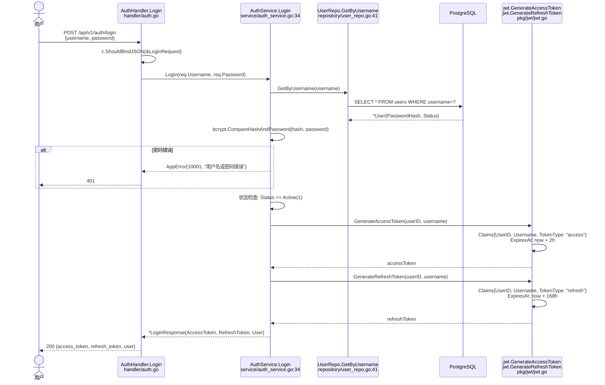
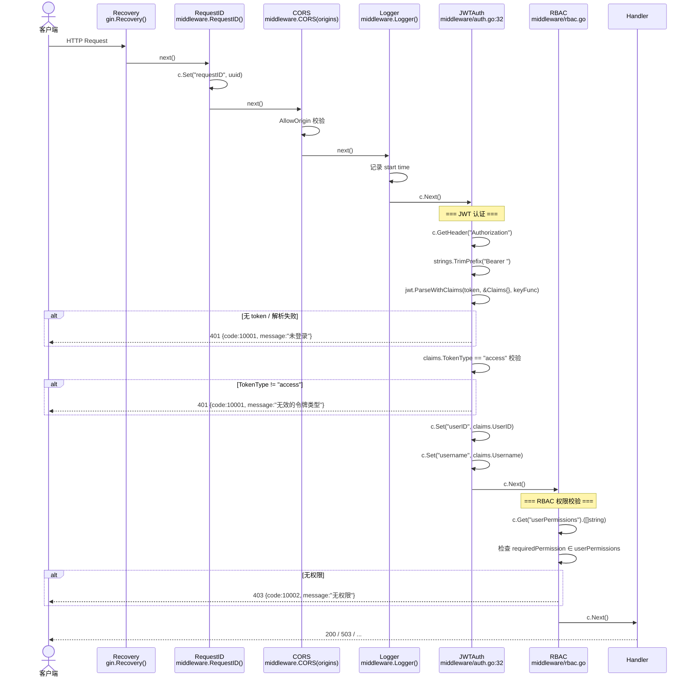
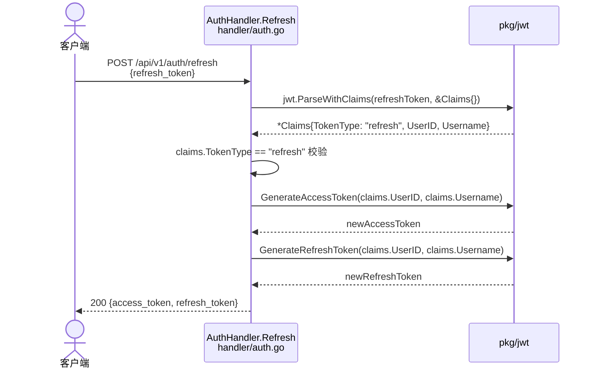

# 认证与 RBAC 权限 v2 — 函数级调用链

> 代码基准：`handler/auth.go` / `middleware/auth.go` / `middleware/rbac.go` / `service/auth_service.go`
> 更新于 2026-06-12 — TokenType 区分 access/refresh，中间件双令牌校验

## 1. 登录与双令牌生成

## 2. 请求认证链（中间件）

## 3. Token 刷新

## 4. 路由分组

```mermaid
flowchart TD
    R[gin.Engine] --> Public["/api/v1/auth<br/>(无中间件)"]
    R --> AuthMe["/api/v1/auth/me<br/>+ JWTAuth"]
    R --> Portal["/api/v1/portal<br/>+ JWTAuth"]
    R --> Admin["/api/v1/admin<br/>+ JWTAuth + RBAC"]

    Public --> Login["POST /login → AuthHandler.Login"]
    Public --> Refresh["POST /refresh → AuthHandler.Refresh"]

    AuthMe --> ChangePwd["POST /change-password → AuthHandler.ChangePassword"]
    AuthMe --> Logout["POST /logout → AuthHandler.Logout"]

    Portal --> Chat["POST /chat-sessions → ChatHandler"]
    Portal --> ChatStream["POST /chat-sessions/stream → ChatHandler"]
    Portal --> Tickets["CRUD /tickets → TicketHandler"]
    Portal --> Messages["/messages → MessageHandler"]

    Admin --> Dashboard["GET /dashboard → DashboardHandler"]
    Admin --> AdminTickets["/tickets → TicketHandler (admin)"]
    Admin --> Users["/users → UserHandler"]
    Admin --> Roles["/roles → RoleHandler"]
    Admin --> KB["/knowledge-bases → KnowledgeHandler"]
    Admin --> LLMConfig["/llm-configs → LLMConfigHandler"]
    Admin --> Audit["/audit-logs → AuditHandler"]
    Admin --> Config["/config → ConfigHandler"]

    style Public fill:#22c55e20,stroke:#22c55e
    style AuthMe fill:#f59e0b20,stroke:#f59e0b
    style Portal fill:#5e6ad220,stroke:#5e6ad2
    style Admin fill:#ef444420,stroke:#ef4444
```

