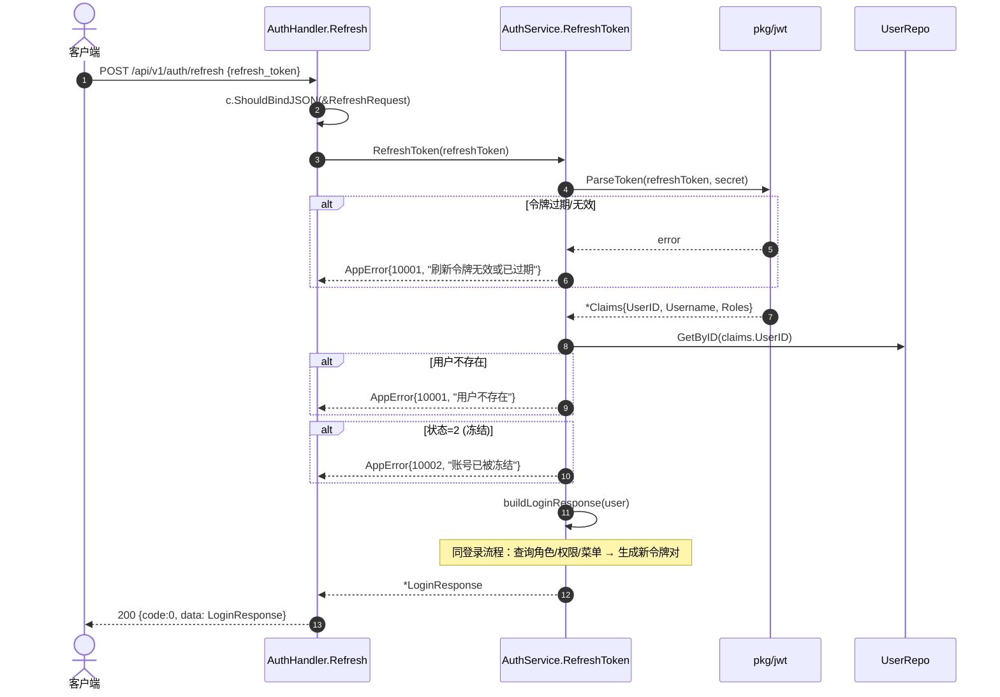
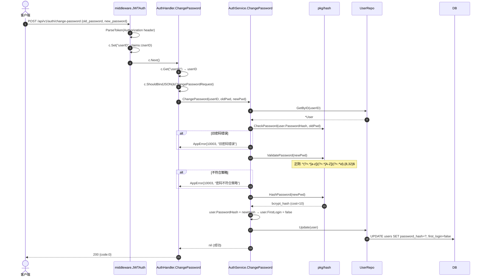
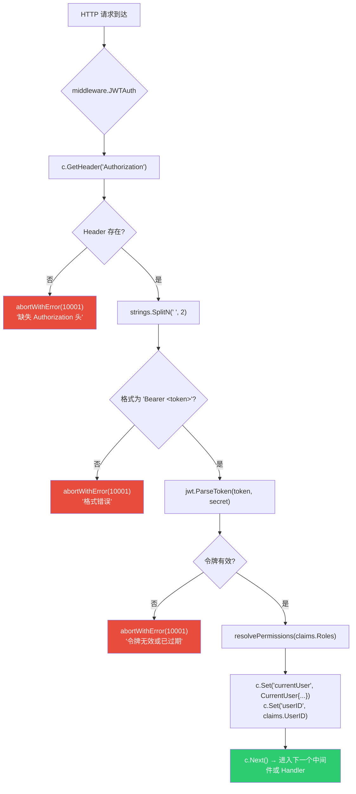
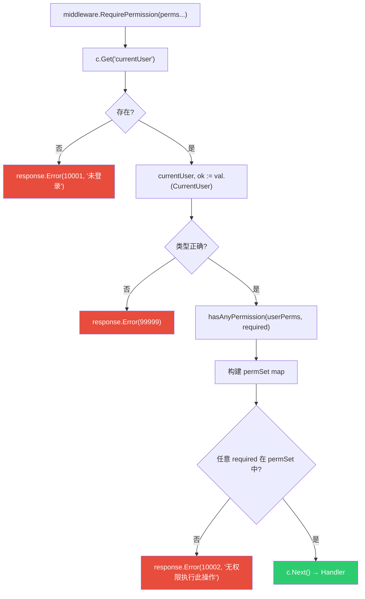

# 认证流程 (Authentication Flow)

> **覆盖模块：** `handler/auth.go` → `service/auth_service.go` → `repository/user_repo.go` → `pkg/jwt` / `pkg/hash`
> **对应任务：** T11（认证 Service + Handler）、T12（JWT 中间件）

---

## 1. 登录流程 (POST /api/v1/auth/login)

```mermaid
sequenceDiagram
    autonumber
    actor Client as 客户端
    participant H as AuthHandler.Login
    participant S as AuthService.Login
    participant R as UserRepo
    participant DB as PostgreSQL
    participant JWT as pkg/jwt
    participant Hash as pkg/hash

    Client->>H: POST /api/v1/auth/login {username, password}
    H->>H: c.ShouldBindJSON(&LoginRequest)
    H->>S: Login(username, password)

    S->>R: GetByUsername(username)
    R->>DB: SELECT * FROM users WHERE username=?
    DB-->>R: User row / nil
    R-->>S: *User / gorm.ErrRecordNotFound

    alt 用户不存在
        S-->>H: AppError{10003, "用户名或密码错误"}
    end

    S->>Hash: CheckPassword(passwordHash, password)
    Hash-->>S: bool

    alt 密码错误
        S-->>H: AppError{10003, "用户名或密码错误"}
    end

    alt 状态=2 (冻结)
        S-->>H: AppError{10002, "账号已被冻结"}
    end

    S->>S: buildLoginResponse(user)

    rect rgb(40, 50, 60)
        Note over S: === buildLoginResponse 内部 ===
        S->>R: GetUserRoles(userID)
        R->>DB: JOIN user_roles + roles
        DB-->>R: []Role
        R-->>S: []Role → roleNames[]

        S->>R: GetUserPermissions(userID)
        R->>DB: JOIN user_roles + roles → Pluck names
        DB-->>R: []string (角色名)
        R-->>S: []string (权限列表，去重)

        S->>S: buildMenuTree(userID, roles)
        alt 系统管理员
            S->>R: ListMenus()
        else 普通用户
            loop 每个角色
                S->>R: GetRoleMenus(roleID)
            end
        end
        S->>S: buildTree(menus, parentID=0)

        S->>JWT: GenerateAccessToken(userID, username, roles, secret, 2h)
        JWT-->>S: access_token
        S->>JWT: GenerateRefreshToken(userID, username, roles, secret, 168h)
        JWT-->>S: refresh_token
    end

    S-->>H: *LoginResponse{access_token, refresh_token, user, roles, permissions, menus}
    H->>H: response.Success(c, resp)
    H-->>Client: 200 {code:0, data: LoginResponse}
```

---

## 2. 刷新令牌 (POST /api/v1/auth/refresh)

---

## 3. 修改密码 (POST /api/v1/auth/change-password)

---

## 4. JWT 认证中间件 (所有受保护路由)

---

## 5. RBAC 权限中间件 (后台管理路由)

