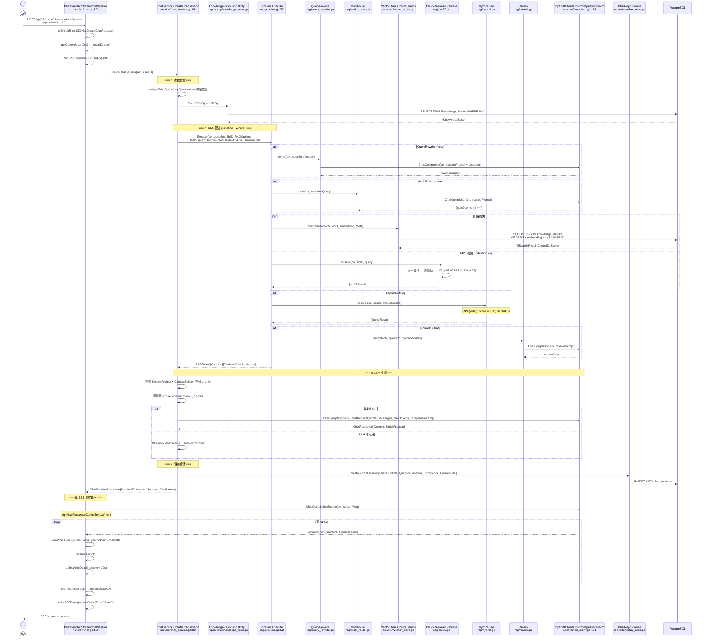
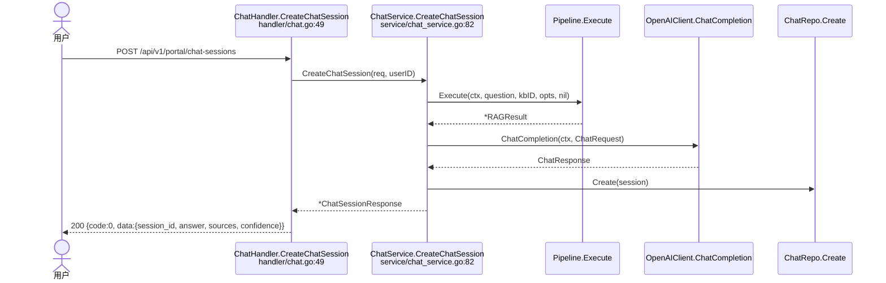
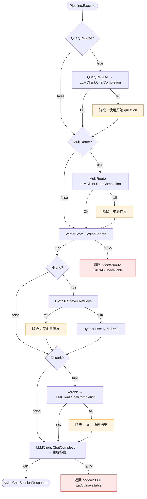

# 智能问答 RAG 管道 v2 — 函数级调用链

> 代码基准：`handler/chat.go` → `service/chat_service.go` → `rag/pipeline.go` → `adapter/llm_client.go`
> 更新于 2026-06-12 — 反映 writeSSEEvent / SetWriteDeadline / TxManager 等重构

## 1. SSE 流式问答 — 完整函数调用链

## 2. 非流式问答

## 3. 降级矩阵

