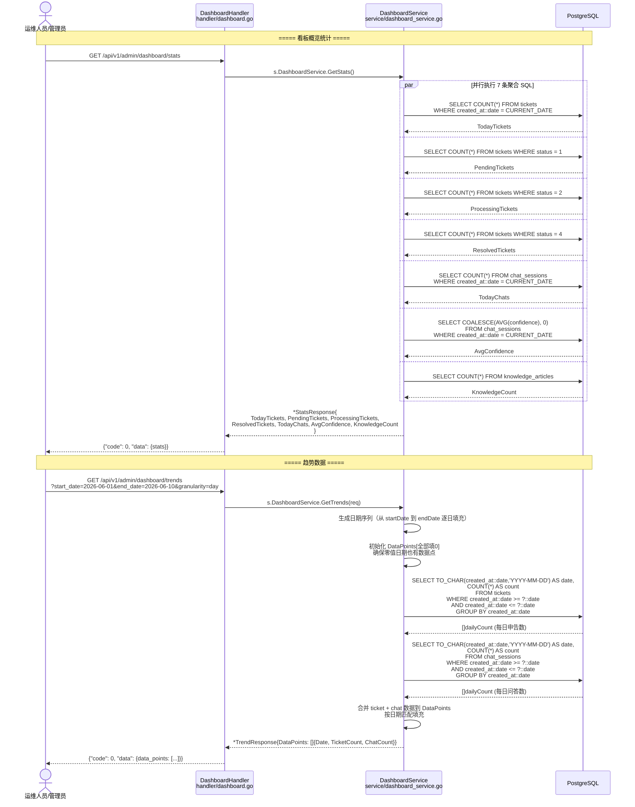
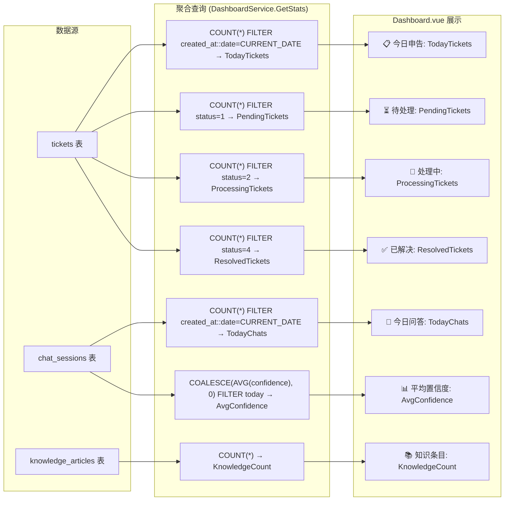
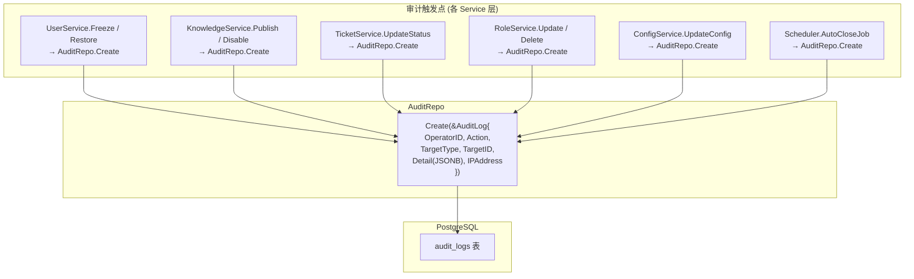
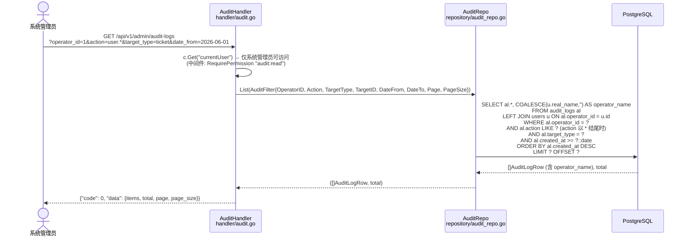
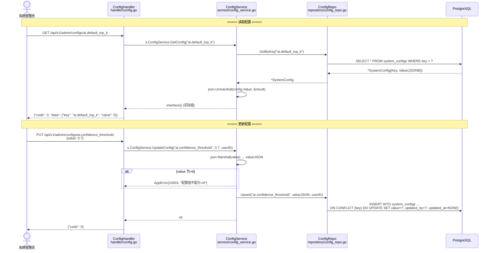
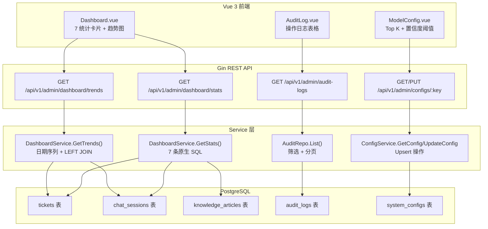

# 数据看板与审计日志流程 (Dashboard & Audit Flow)

> **涉及文件：** `handler/dashboard.go` → `service/dashboard_service.go` (原生 SQL)
> **审计：** `handler/audit.go` → `repository/audit_repo.go` (分散在各 Service 中写入)
> **配置：** `handler/config.go` → `service/config_service.go` → `repository/config_repo.go`

---

## 1. 数据看板统计流程

---

## 2. 看板统计指标计算公式

---

## 3. 审计日志写入流程（分散在各 Service 中触发）

---

## 4. 审计日志查询流程

---

## 5. 系统配置读写流程

---

## 6. 完整数据流总览

