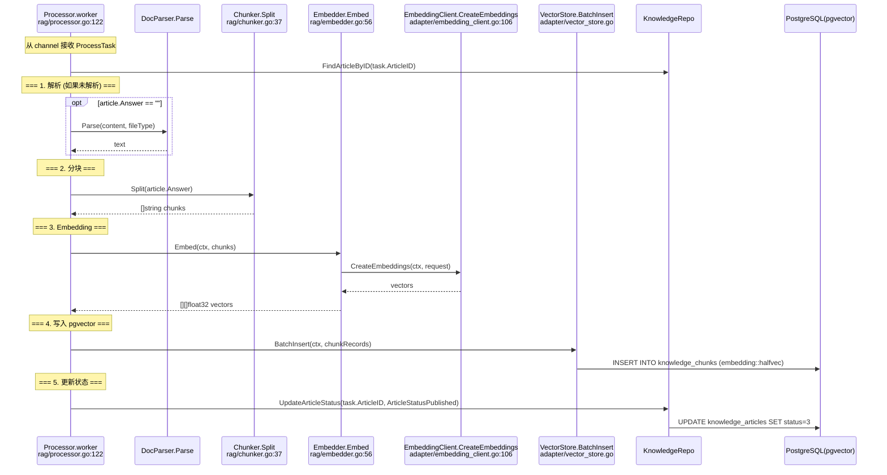
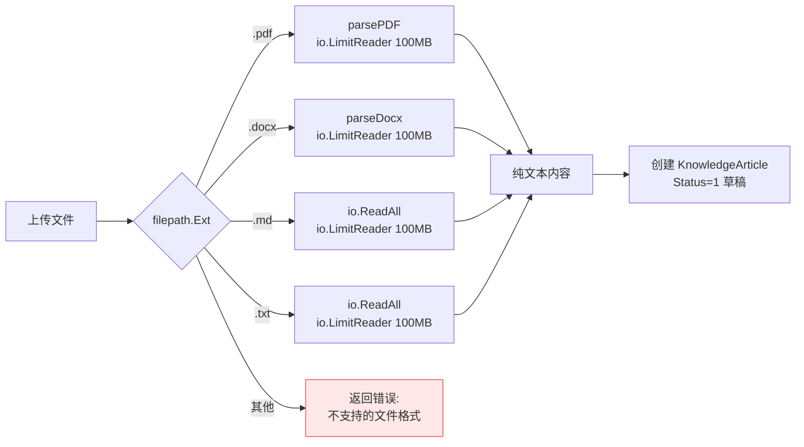

# 文档上传与异步处理 v2 — 函数级调用链

> 代码基准：`handler/knowledge.go:UploadDocuments` → `service/knowledge_service.go:UploadDocuments` → `rag/document_parser.go` / `rag/processor.go`
> 更新于 2026-06-12 — 文件校验已移至 Service 层，100MB 读取上限

## 1. 上传流程

```mermaid
sequenceDiagram
    actor U as 管理员
    participant KH as KnowledgeHandler.UploadDocuments<br/>handler/knowledge.go:306
    participant KS as KnowledgeService.UploadDocuments<br/>service/knowledge_service.go:431
    participant DP as DocParser.Parse<br/>rag/document_parser.go:46
    participant PR as Processor.Submit<br/>rag/processor.go
    participant KR as KnowledgeRepo<br/>repository/knowledge_repo.go
    participant DB as PostgreSQL

    U->>KH: POST /api/v1/admin/knowledge-bases/:kb_id/documents/upload<br/>multipart/form-data: file
    KH->>KH: parseID(c, "kb_id")
    KH->>KH: c.FormFile("file")

    Note over KH: Handler 只做请求解析
    KH->>KH: fileType = strings.TrimPrefix(ext, ".")

    Note over KH: 打开文件流
    KH->>KH: file.Open() → src io.Reader
    KH->>KH: getCurrentUserID(c)

    KH->>KS: UploadDocuments(kbID, userID, filename, fileType, fileSize, src)

    Note over KS: === 1. 格式白名单校验 (Service 层) ===
    KS->>KS: allowedTypes = {pdf, docx, md, txt}
    KS->>KS: if !allowedTypes[fileType] → 返回错误

    Note over KS: === 2. 文件大小上限校验 ===
    KS->>KS: const maxSize = 50 * 1024 * 1024
    KS->>KS: if fileSize > maxSize → 返回错误

    Note over KS: === 3. 文档解析 ===
    KS->>DP: Parse(content, fileType)
    DP->>DP: io.LimitReader(reader, 100MB) — OOM 防护
    DP->>DP: 按文件类型分发:
    alt PDF
        DP->>DP: parsePDF(reader)
    else DOCX
        DP->>DP: parseDocx(reader)
    else MD/TXT
        DP->>DP: io.ReadAll(reader)
    end
    DP-->>KS: string text

    Note over KS: === 4. 创建文章 (草稿) ===
    KS->>KS: strings.TrimSpace(text) — 空内容检查
    KS->>KR: CreateArticle(&KnowledgeArticle{<br/>KBID, Question: filename, Answer: text, Status: Draft=1})
    KR->>DB: INSERT INTO knowledge_articles
    DB-->>KR: article.ID

    Note over KS: === 5. 入队异步处理 ===
    KS->>PR: Submit(task)
    PR->>PR: 非阻塞: select { case ch <- task: ok; default: return err }
    PR-->>KS: nil / err

    KS-->>KH: *KnowledgeArticle{ID, Status}

    KH-->>U: 200 {message: "文档已接收，正在后台处理", article_id, filename}
```

## 2. 后台处理器



## 3. 支持的文件格式


