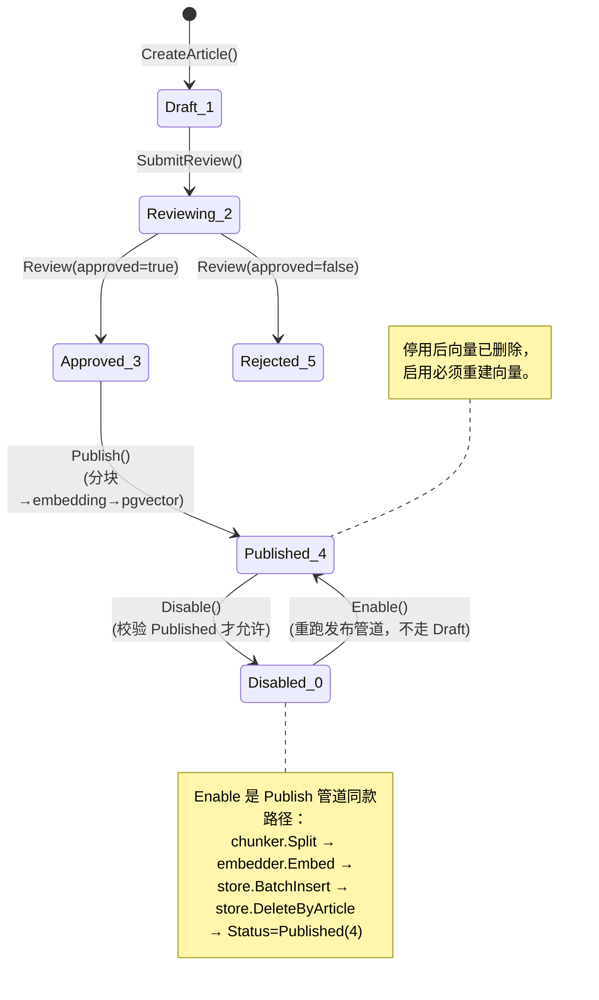
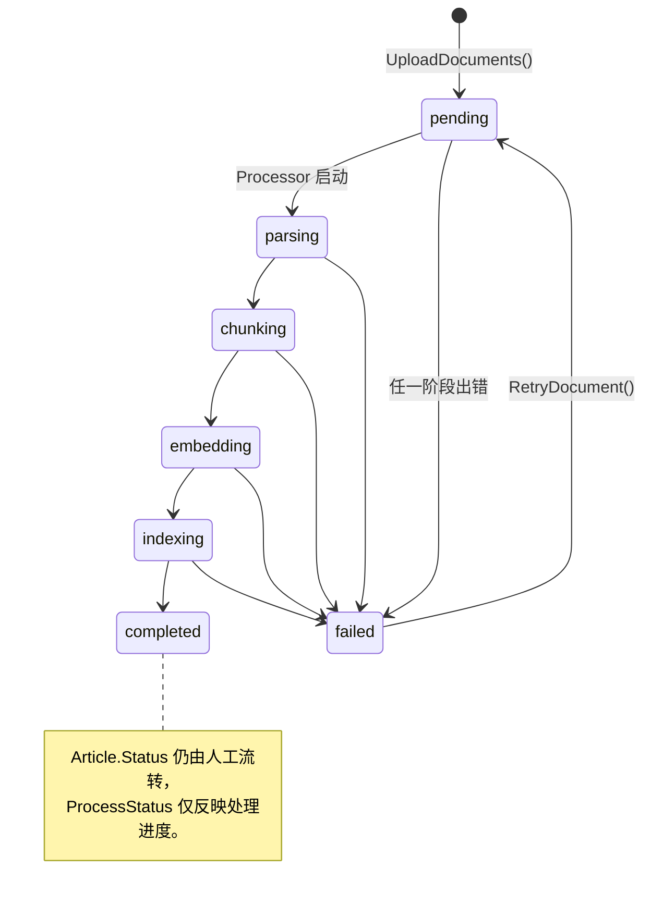
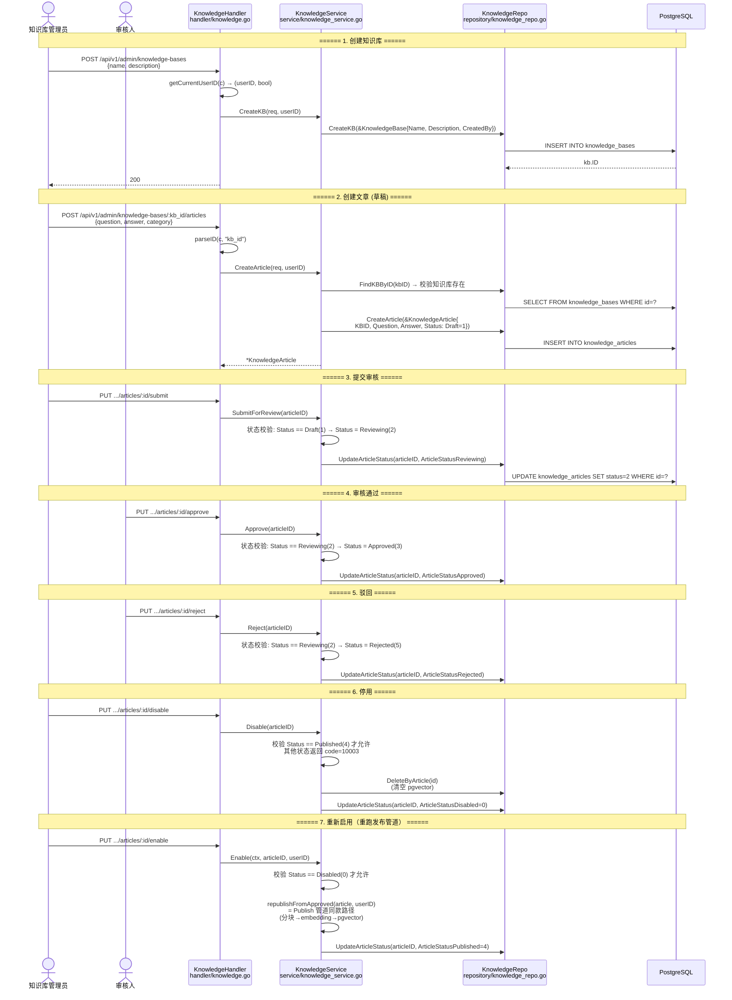
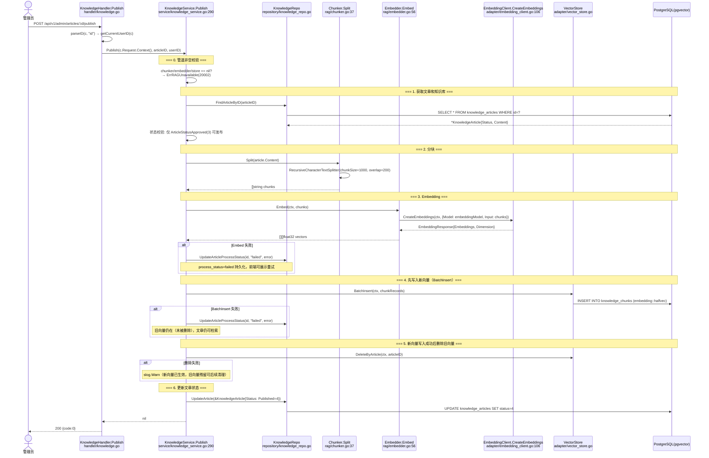
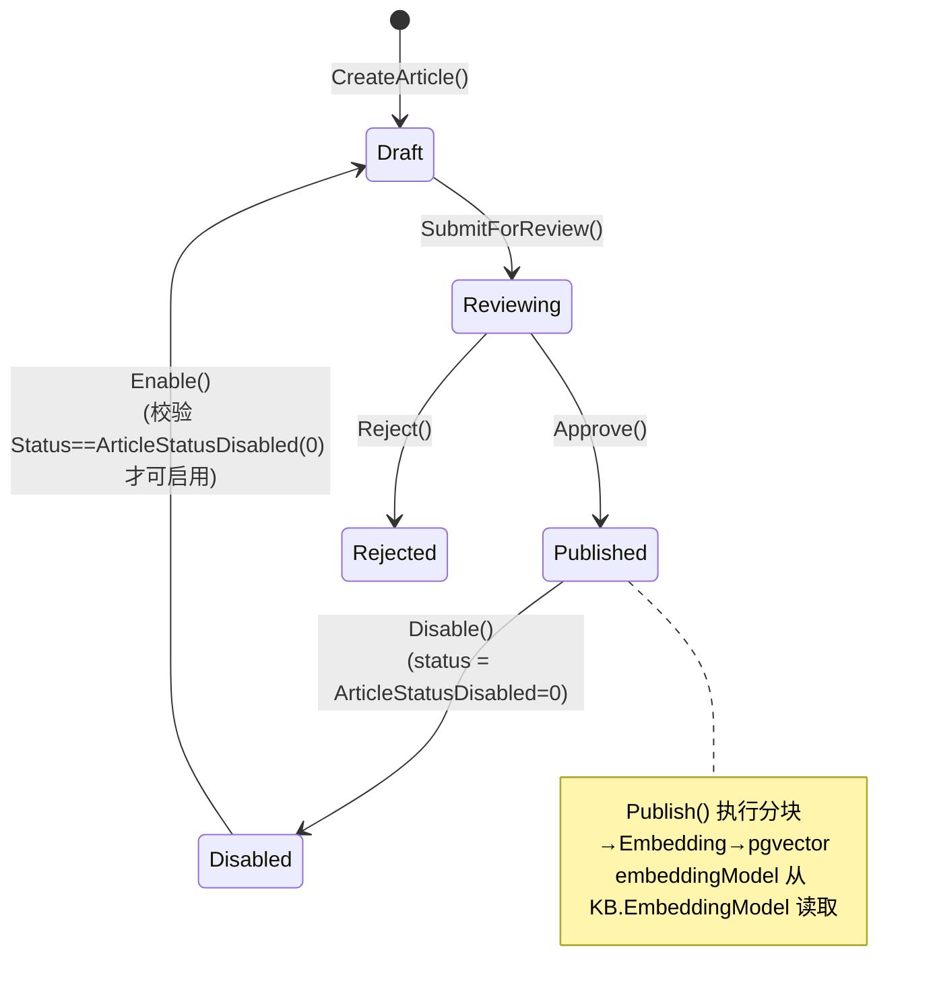
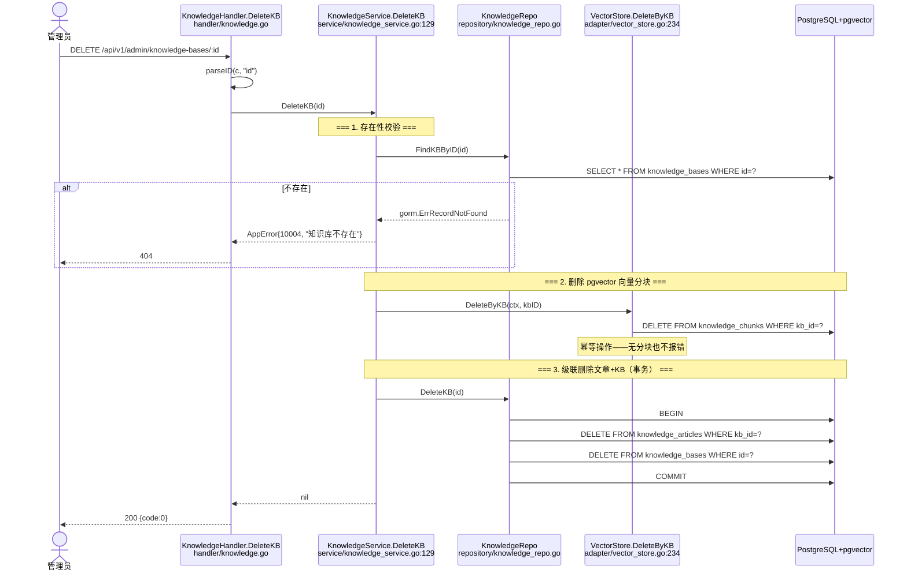
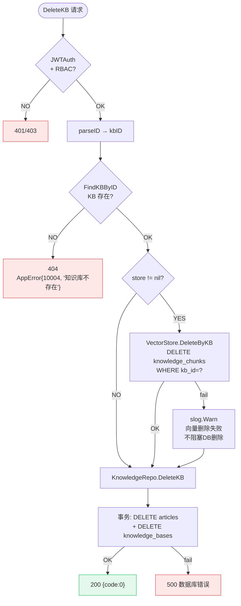

# 知识发布管道 — 函数级调用链

> 代码基准：`handler/knowledge.go` → `service/knowledge_service.go` → `rag/chunker.go` / `rag/embedder.go` / `adapter/vector_store.go`
> 更新于 2026-06-17 — 文章状态机重构：
>
> - Disable 仅允许 `Published(4) → Disabled(0)`，拒绝其他状态直接 Disable
> - Enable 直接 `Disabled(0) → Published(4)`，**复用发布管道**（不再走 Draft）
> - 状态机与 process_status 解耦：文档处理进度不再污染 Article.Status

## 1. 文章生命周期（创建→审核→发布→停用→重新启用）

**审核状态机**（`Article.Status` 字段，由人工操作流转）：

**文档处理状态机**（`Article.ProcessStatus` 字段，与 Status 互不污染）：

**完整生命周期序列图：**

## 2. 发布管道（pgvector 向量写入）

> 更新于 2026-06-17 — ctx 传递、先写后删、失败记录 process_status

## 3. 文章状态机

## 4. 知识库删除流程（🆕 2026-06-17）

## 5. KB 删除决策流程图

