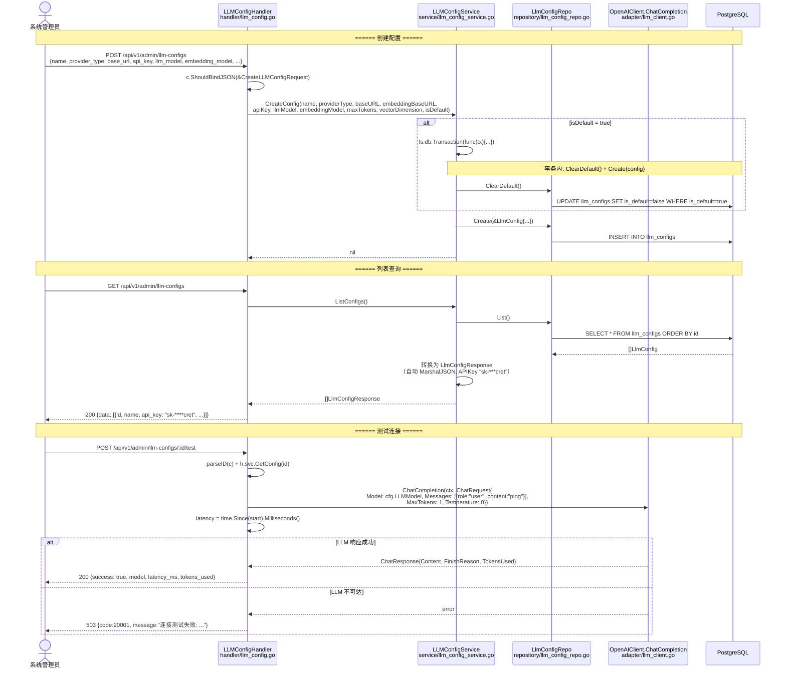
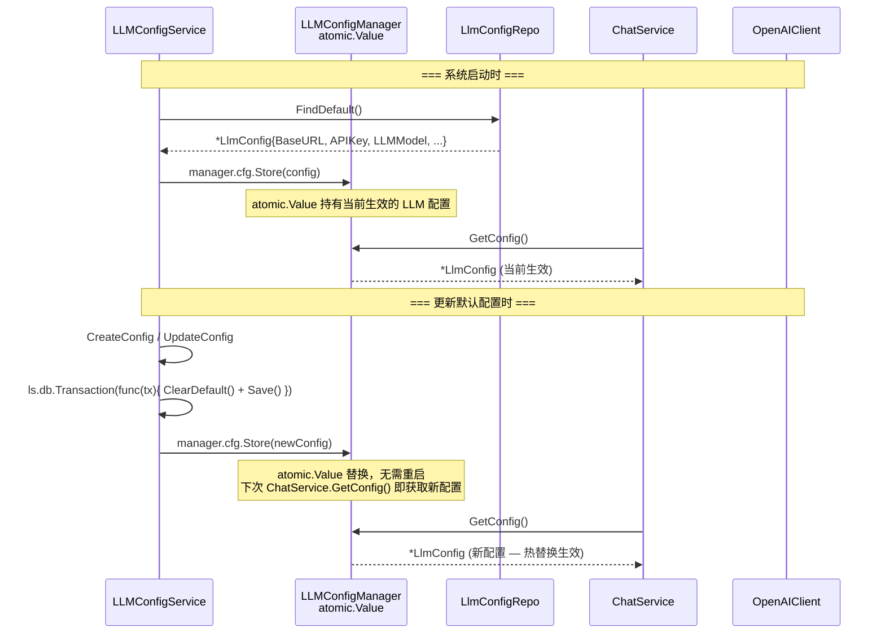
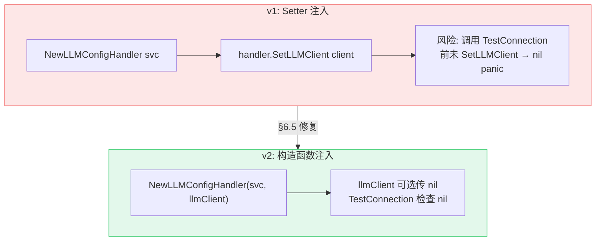

# LLM 配置管理 v2 — 函数级调用链

> 代码基准：`handler/llm_config.go` → `service/llm_config_service.go` → `repository/llm_config_repo.go`
> 更新于 2026-06-12 — 构造函数注入 / APIKey MarshalJSON 自动脱敏 / 事务包裹

## 1. CRUD + 测试连接



## 2. atomic.Value 热替换



## 3. API Key 自动脱敏

```mermaid
flowchart LR
    Create[CreateConfig<br/>apiKey = "sk-abc123..."] --> Save[LlmConfigRepo.Create<br/>明文写入 DB]
    List[ListConfigs<br/>LlmConfigRepo.List] --> Marshal[LlmConfigResponse.MarshalJSON]
    Marshal --> Mask{"len(apiKey) > 8?"}
    Mask -->|Yes| Masked["sk-ab****23<br/>(前4+后4, 中间***)"]
    Mask -->|No| Short["****"]
    Masked --> Response[200 JSON Response]
    Short --> Response
```

## 4. 构造函数演进


