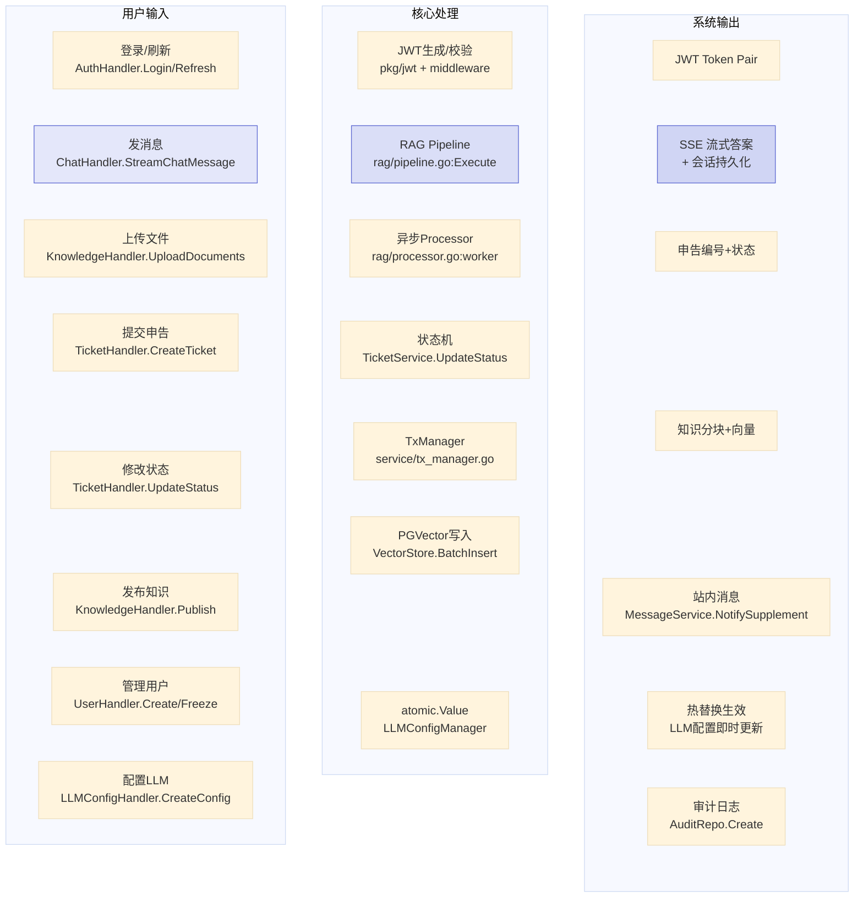

# OpsMind 全业务数据流总览

> 覆盖全部 10 个业务模块的端到端数据流，着重函数名从输入→处理→输出。
> 最后更新：2026-06-17

## 0. 全景路由映射

```mermaid
%%{init: {"theme": "base", "themeVariables": {"background": "transparent"}}}%%
flowchart TB
    subgraph Client["客户端层"]
        Browser["Vue 3 浏览器<br/>/portal/* /admin/*"]
    end

    subgraph Entry["Gin Router :8080 (router.go:Setup)"]
        direction TB
        Health["GET /health"]
        Auth["/api/v1/auth<br/>POST /login → AuthHandler.Login<br/>POST /refresh → AuthHandler.Refresh"]
        AuthMe["/api/v1/auth/me [+JWTAuth]<br/>POST /change-password → AuthHandler.ChangePassword<br/>POST /logout → AuthHandler.Logout"]
        Portal["/api/v1/portal [+JWTAuth]<br/>POST /chat-sessions → ChatHandler.CreateChatSession<br/>POST /chat-sessions/:id/stream → ChatHandler.StreamChatMessage<br/>GET /chat-sessions → ChatHandler.ListSessions<br/>GET /chat-sessions/:id → ChatHandler.GetChatDetail<br/>DELETE /chat-sessions/:id → ChatHandler.DeleteSession<br/>POST /chat-sessions/:id/feedback → ChatHandler.SubmitFeedback<br/>POST /tickets → TicketHandler.CreateTicket<br/>GET /tickets → TicketHandler.ListByUser<br/>GET /tickets/:id → TicketHandler.GetDetail<br/>PATCH /tickets/:id/supplement → TicketHandler.SupplementTicket<br/>GET /knowledge-bases → KnowledgeHandler.ListKBsForPortal<br/>GET /messages → MessageHandler.ListMessages<br/>PUT /messages/:id/read → MessageHandler.MarkAsRead<br/>GET /messages/unread-count → MessageHandler.CountUnread"]
        Admin["/api/v1/admin [+JWTAuth+RBAC]"]

        subgraph AdminDetail["后台路由详情"]
            direction TB
            TKT["/tickets → TicketHandler.ListAll/GetDetail/UpdateStatus/AddRecord/CreateKnowledgeCandidate"]
            KB["/knowledge-bases → KnowledgeHandler: CRUD + DeleteKB<br/>/articles → KnowledgeHandler: CRUD + Review + Publish + Disable + Enable<br/>/documents → KnowledgeHandler: Upload + Status + Retry"]
            USR["/users → UserHandler.List/Create/GetByID/Update/Freeze/Restore"]
            ROL["/roles → RoleHandler.List/Create/GetByID/Update/Delete<br/>/roles/:id/menus → RoleHandler.UpdateRoleMenus<br/>/menus → RoleHandler.ListMenus"]
            LLM["/llm-configs → LLMConfigHandler: 6 CRUD + TestConnection"]
            DASH["/dashboard → DashboardHandler.GetStats/GetTrends"]
            AUDIT["/audit-logs → AuditHandler.List"]
            CFG["/configs/:key → ConfigHandler.Get/Update"]
        end
    end

    Browser --> Entry
    style Portal fill:#5e6ad220,stroke:#5e6ad2
    style Admin fill:#ef444420,stroke:#ef4444
```

## 1. 认证数据流（AuthService → JWT → Middleware）

```mermaid
%%{init: {"theme": "base", "themeVariables": {"background": "transparent"}}}%%
sequenceDiagram
    actor U as 用户
    participant AH as AuthHandler<br/>handler/auth.go
    participant AS as AuthService<br/>service/auth_service.go:34
    participant UR as UserRepo<br/>repository/user_repo.go:41
    participant JWT as jwt.GenerateAccessToken<br/>pkg/jwt/jwt.go
    participant MW as JWTAuth<br/>middleware/auth.go:32
    participant RBAC as RequirePermission<br/>middleware/rbac.go

    rect rgb(40,50,60)
        Note over U,JWT: === Login（输入 username+password → 输出 JWT pair） ===
        U->>AH: AuthHandler.Login(c) — POST /api/v1/auth/login
        AH->>AH: c.ShouldBindJSON(&LoginRequest)
        AH->>AH: getCurrentUserID(c)
        AH->>AS: Login(req.Username, req.Password)
        AS->>UR: GetByUsername(username) — SELECT FROM users
        UR-->>AS: *User{PasswordHash, Status}
        AS->>AS: bcrypt.CompareHashAndPassword → status check
        AS->>JWT: GenerateAccessToken(userID, username) — 2h
        AS->>JWT: GenerateRefreshToken(userID, username) — 168h
        AS-->>AH: *LoginResponse{AccessToken, RefreshToken, User, Roles, Permissions, Menus}
        AH-->>U: 200 {code:0, data:{access_token, refresh_token, user, roles, permissions, menus}}
    end

    rect rgb(40,50,60)
        Note over U,RBAC: === 后续请求认证（Middleware 链） ===
        U->>MW: Authorization: Bearer <access_token>
        MW->>MW: jwt.ParseWithClaims(token, &Claims{}, keyFunc)
        MW->>MW: claims.TokenType == "access" 校验
        MW->>MW: c.Set("userID", claims.UserID)
        MW->>RBAC: c.Next()
        RBAC->>RBAC: c.Get("userPermissions") → 检查 requiredPermission
    end
```

## 2. 智能问答 RAG 数据流（ChatService → Pipeline → SSE）

```mermaid
%%{init: {"theme": "base", "themeVariables": {"background": "transparent"}}}%%
sequenceDiagram
    actor U as 用户
    participant CH as ChatHandler<br/>handler/chat.go
    participant CS as ChatService<br/>service/chat_service.go:119
    participant LS as LLMService<br/>service/llm_service.go:198
    participant Pipe as Pipeline.Execute<br/>rag/pipeline.go:52
    participant QR as QueryRewrite<br/>rag/query_rewrite.go
    participant VR as VectorRetriever<br/>rag/vector_retriever.go
    participant B5 as BM25Retriever<br/>rag/bm25.go:262
    participant HF as HybridFuse<br/>rag/hybrid.go
    participant RR as Rerank<br/>rag/rerank.go
    participant LLM as OpenAIClient<br/>adapter/llm_client.go:191
    participant DB as PostgreSQL+pgvector

    rect rgb(40,50,60)
        Note over U,DB: === 1. 创建会话容器（输入 kb_id → 输出 session_id） ===
        U->>CH: CreateChatSession(c) — POST /chat-sessions
        CH->>CH: c.ShouldBindJSON(&CreateSessionRequest)
        CH->>CS: CreateSession(req, userID)
        CS->>CS: FindKBByID → 校验知识库存在
        CS->>CS: Create(&ChatSession{UserID, KBID}) → INSERT
        CS-->>CH: *ChatSession{ID}
        CH-->>U: 200 {code:0, data:{session_id, kb_id}}
    end

    rect rgb(40,50,60)
        Note over U,DB: === 2. 流式问答（输入 question+sesson_id → SSE Stream） ===
        U->>CH: StreamChatMessage(c) — POST /chat-sessions/:id/stream
        CH->>CH: parseID("id") → c.ShouldBindJSON(&SendMessageRequest)
        CH->>CH: Set SSE headers → c.Status(200)
        CH->>CS: StreamChat(ctx, sessionID, question, userID)
        CS->>CS: strings.TrimSpace(question) → FindByID(sessionID) → 归属校验
        CS->>LS: StreamChat(ctx, question, kbID, opts, history)

        Note over LS,VR: RAG 管道
        LS->>Pipe: Execute(ctx, question, kbID, opts, onStep)
        Pipe->>QR: rewrite(ctx, query, history) → LLMClient.ChatCompletion
        Pipe->>VR: Retrieve(ctx, kbID, queryEmbedding) → VectorStore.CosineSearch
        Pipe->>B5: Retrieve(ctx, query, kbID, topK) → gse分词 + Okapi BM25
        Pipe->>HF: fuse(vectorResults, bm25Results) → RRF(k=60)
        Pipe->>RR: Rerank(ctx, query, candidates) → cross-encoder/LLM
        Pipe-->>LS: *RAGResult{Chunks, Metrics}

        Note over LS,LLM: LLM 流式生成
        LS->>LS: buildMessages + getModelConfig()
        LS->>LLM: ChatCompletionStream(ctx, ChatRequest{Model, Messages, Stream:true})
        loop 逐 token
            LLM-->>LS: StreamChunk{Content}
            LS->>LS: eventCh ← StreamEvent{Type:"token", Content}
        end
        LS->>LS: extractSources → maxConfidence → 兜底判断
        LS->>LS: eventCh ← StreamEvent{Type:"done", Metadata}

        Note over CH: SSE 事件代理 + 持久化
        loop 逐事件
            LS-->>CS: StreamEvent (via channel)
            CS-->>CH: writeSSEEvent(w, evt) → flusher.Flush()
            CH-->>U: data: {"type":"token","content":"..."}
        end
        CS->>CS: done事件 → UpdateSession + CreateBatch消息
        CS->>CS: UPDATE chat_sessions + INSERT chat_messages
        CH-->>U: data: {"type":"done","metadata":{...}}
    end
```

## 3. 知识库全生命周期（KB CRUD → 文章状态机 → Publish管道 → DeleteKB）

```mermaid
%%{init: {"theme": "base", "themeVariables": {"background": "transparent"}}}%%
sequenceDiagram
    actor A as 管理员/审核人
    participant KH as KnowledgeHandler<br/>handler/knowledge.go
    participant KS as KnowledgeService<br/>service/knowledge_service.go
    participant KR as KnowledgeRepo<br/>repository/knowledge_repo.go
    participant CH as Chunker.Split<br/>rag/chunker.go:37
    participant EM as Embedder.Embed<br/>rag/embedder.go:56
    participant VS as VectorStore<br/>adapter/vector_store.go
    participant DB as PostgreSQL+pgvector

    rect rgb(40,50,60)
        Note over A,DB: === KB CRUD（输入 name+embedding_model → 输出 kb_id） ===
        A->>KH: CreateKB(c) — POST /admin/knowledge-bases
        KH->>KS: CreateKB(req, userID)
        KS->>KR: CreateKB(&KnowledgeBase{Name, EmbeddingModel, VectorDimension})
        KR->>DB: INSERT INTO knowledge_bases
        KS-->>KH: nil
        KH-->>A: 200

        A->>KH: UpdateKB(c) — PUT /admin/knowledge-bases/:id
        KH->>KS: UpdateKB(id, req)
        KS->>KR: FindKBByID(id) → 更新字段 → Save(kb)
        KS-->>KH: nil

        A->>KH: DeleteKB(c) — DELETE /admin/knowledge-bases/:id
        KH->>KS: DeleteKB(id)
        KS->>KR: FindKBByID(id) — 校验存在
        KS->>VS: DeleteByKB(ctx, kbID) — 删除 pgvector 向量
        KS->>KR: DeleteKB(id) — 事务: DELETE articles + DELETE kb
        KR->>DB: BEGIN → DELETE articles WHERE kb_id=? → DELETE kb WHERE id=? → COMMIT
        KS-->>KH: nil
        KH-->>A: 200
    end

    rect rgb(40,50,60)
        Note over A,DB: === 文章状态机（Draft→Reviewing→Published→Disabled） ===
        A->>KH: CreateArticle(c) — POST /admin/knowledge-bases/:kb_id/articles
        KH->>KS: CreateArticle(req, userID)
        KS->>KR: FindKBByID → CreateArticle(&KnowledgeArticle{Status:Draft=1})
        KR->>DB: INSERT INTO knowledge_articles

        A->>KH: SubmitReview(c) — POST /admin/articles/:id/submit-review
        KH->>KS: SubmitReview(id, userID)
        KS->>KS: 状态校验 Draft→Reviewing
        KS->>KR: UpdateArticleStatus(id, ArticleStatusReviewing=2)

        A->>KH: Review(c) — POST /admin/articles/:id/review {approved:true}
        KH->>KS: Review(id, reviewerID, req)
        KS->>KS: 审核人≠创建人校验 → approved? Status=3(通过):Status=6(驳回)
        KS->>KR: UpdateArticleStatus + SaveReviewInfo
    end

    rect rgb(40,50,60)
        Note over A,DB: === Publish管道（ctx 传递；先写后删防丢失；失败记录 process_status） ===
        A->>KH: Publish(c) — POST /admin/articles/:id/publish
        KH->>KS: Publish(c.Request.Context(), id, publisherID)
        KS->>KS: chunker/embedder/store nil? → ErrRAGUnavailable(20002)
        KS->>KR: FindArticleByID(id) — status==Approved(3) 校验
        KS->>KS: embeddingModel = kb.EmbeddingModel（非硬编码）
        KS->>CH: Split(article.Content) — chunkSize=1000, overlap=200
        CH-->>KS: []string chunks
        KS->>EM: Embed(ctx, chunks) — /v1/embeddings
        alt Embed/BatchInsert 失败
            KS->>KR: recordPublishFailure → process_status=failed
        end
        EM-->>KS: [][]float32 vectors
        KS->>VS: BatchInsert(ctx, chunkRecords) — 先写
        VS->>DB: INSERT INTO knowledge_chunks (embedding::halfvec)
        KS->>VS: DeleteByArticle(ctx, id) — 后删旧向量（失败不阻塞）
        KS->>KR: UpdateArticle(&KnowledgeArticle{Status: Published=4})
        KS-->>KH: nil
        KH-->>A: 200
    end
```

## 4. 文档上传异步处理（Upload → Parse → Chunk → Embed → Store）

```mermaid
%%{init: {"theme": "base", "themeVariables": {"background": "transparent"}}}%%
sequenceDiagram
    actor U as 管理员
    participant KH as KnowledgeHandler<br/>handler/knowledge.go:306
    participant KS as KnowledgeService<br/>service/knowledge_service.go:490
    participant DP as DocParser.Parse<br/>rag/document_parser.go:46
    participant PR as Processor.Submit<br/>rag/processor.go
    participant Worker as Processor.worker<br/>rag/processor.go:122
    participant CH as Chunker.Split
    participant EM as Embedder.Embed
    participant VS as VectorStore.BatchInsert
    participant DB as PostgreSQL+pgvector

    rect rgb(40,50,60)
        Note over U,PR: === 同步阶段：上传+解析+入队（输入 multipart file → 输出 article_id） ===
        U->>KH: UploadDocuments(c) — POST /admin/knowledge-bases/:kb_id/documents/upload
        KH->>KH: c.FormFile("file") → file.Open() → getCurrentUserID(c)
        KH->>KS: UploadDocuments(kbID, userID, filename, fileType, fileSize, src)
        KS->>KS: 格式白名单 {pdf,docx,md,txt} → 大小上限 50MB
        KS->>DP: Parse(content, fileType)
        DP->>DP: io.LimitReader(100MB) → 按类型分发: parsePDF/parseDocx/io.ReadAll
        DP-->>KS: string text
        KS->>KS: CreateArticle(&KnowledgeArticle{Status:Draft, SourceType:upload})
        KS->>KS: strings.TrimSpace(text) — 空内容检查
        KS->>KR: CreateArticle(article) → INSERT INTO knowledge_articles
        KS->>PR: Submit(task{ArticleID, KBID})
        PR->>PR: 非阻塞 select → ch ← task（满则返回 err）
        KS-->>KH: *KnowledgeArticle
        KH-->>U: 200 {article_id, process_status:"pending"}
    end

    rect rgb(40,50,60)
        Note over Worker,DB: === 异步阶段：goroutine pool → 解析→分块→Embedding→写入 ===
        Worker->>Worker: ← ch 接收 ProcessTask
        Worker->>KR: FindArticleByID(task.ArticleID)
        Worker->>CH: Split(article.Content) → []chunks
        Worker->>EM: Embed(ctx, chunks) → EmbeddingClient.CreateEmbeddings
        Worker->>VS: BatchInsert(ctx, chunkRecords) → INSERT INTO knowledge_chunks
        Worker->>KR: UpdateArticleStatus(id, Published) + UpdateArticleMetrics
        Note over Worker: process_status: pending→parsing→chunking→embedding→completed
    end
```

## 5. 申告全生命周期（Create → StateMachine → Supplement → AutoClose）

```mermaid
%%{init: {"theme": "base", "themeVariables": {"background": "transparent"}}}%%
sequenceDiagram
    actor R as 报障人
    actor O as 运维人员
    participant TH as TicketHandler<br/>handler/ticket.go
    participant TS as TicketService<br/>service/ticket_service.go
    participant TR as TicketRepo<br/>repository/ticket_repo.go
    participant MS as MessageService<br/>service/message_service.go
    participant Sched as Scheduler<br/>service/scheduler.go:55
    participant DB as PostgreSQL

    rect rgb(40,50,60)
        Note over R,DB: === CreateTicket（输入 title+description+urgency → 输出 ticket_no） ===
        R->>TH: CreateTicket(c) — POST /api/v1/portal/tickets
        TH->>TH: c.ShouldBindJSON(&CreateTicketRequest) → getCurrentUserID(c)
        TH->>TS: CreateTicket(req, userID)
        TS->>TS: 校验: title/description/contact_phone 必填, urgency ∈ [1,3]
        TS->>TS: ticket_no = TK-YYYYMMDD-XXXX（日期+4位序号）
        TS->>TR: Create(&Ticket{Status:Pending=1, Source:Portal=1})
        TR->>DB: INSERT INTO tickets
        TS-->>TH: nil
        TH-->>R: 200 {code:0, message:"申告已创建"}
    end

    rect rgb(40,50,60)
        Note over O,DB: === UpdateStatus 状态机（输入 action → 状态转换+记录+通知） ===
        O->>TH: UpdateStatus(c) — PATCH /admin/tickets/:id/status {action}
        TH->>TS: UpdateStatus(id, operatorID, req)
        TS->>TR: FindByID(id) → *Ticket{Status}
        TS->>TS: switch req.Action — 状态机校验
        alt action="start" (Pending→Processing)
            TS->>TS: TxManager.Transaction → Update status=2 + CreateRecord
        else action="request_info" (Processing→NeedSupplement)
            TS->>TS: TxManager.Transaction → Update status=3 + CreateRecord
            TS->>MS: NotifySupplement(ticketID, userID) → INSERT messages
        else action="resolve" (Processing→Resolved)
            TS->>TS: TxManager.Transaction → Update status=4 + CreateRecord
        else action="close" (任意→Closed)
            TS->>TS: TxManager.Transaction → Update status=5 + CreateRecord
        end
        TS-->>TH: nil
        TH-->>O: 200
    end

    rect rgb(40,50,60)
        Note over R,DB: === SupplementTicket（输入 content → 补充次数检查+状态回退） ===
        R->>TH: SupplementTicket(c) — PATCH /portal/tickets/:id/supplement
        TH->>TS: SupplementTicket(id, userID, req)
        TS->>TR: FindByID(id)
        TS->>TS: 校验: userID=owner + status=3
        TS->>TR: IncrementSupplementCount(id) — UPDATE supplement_count+1 WHERE count<3
        TS->>TR: UpdateStatus(id, Processing=2) + CreateRecord
        TS-->>TH: nil
        TH-->>R: 200
    end

    rect rgb(40,50,60)
        Note over Sched,DB: === AutoClose（每小时触发 → status∈{1,2,3}且>7天 → Closed） ===
        Sched->>Sched: time.NewTicker(1*Hour) → runAutoCloseLoop
        Sched->>TS: AutoClose(time.Now().Add(-7*24*Hour))
        TS->>TR: AutoCloseTickets(olderThan)
        TR->>DB: SELECT id FROM tickets WHERE status IN(1,2,3) AND created_at<?
        TR->>DB: UPDATE tickets SET status=5 WHERE id IN(...)
        TR-->>TS: []int64 closedIDs
        TS->>TS: TxManager.Transaction → 批量 CreateRecord(action="auto_close")
    end
```

## 6. 用户与角色权限数据流

```mermaid
%%{init: {"theme": "base", "themeVariables": {"background": "transparent"}}}%%
sequenceDiagram
    actor A as 系统管理员
    participant UH as UserHandler<br/>handler/user.go
    participant US as UserService<br/>service/user_service.go
    participant UR as UserRepo<br/>repository/user_repo.go
    participant RH as RoleHandler<br/>handler/role.go
    participant RS as RoleService<br/>service/role_service.go
    participant RR as RoleRepo<br/>repository/role_repo.go
    participant DB as PostgreSQL

    rect rgb(40,50,60)
        Note over A,DB: === User CRUD ===
        A->>UH: Create(c) — POST /admin/users {username, password, role_ids}
        UH->>US: Create(req)
        US->>UR: ExistsByUsername(username) — 唯一性检查
        US->>US: ValidatePassword(password) — 正则 ^(?=.*[a-z])(?=.*[A-Z])(?=.*\d).{8,32}$
        US->>US: HashPassword(password) — bcrypt cost=10
        US->>UR: Create(&User{Status:1, FirstLogin:true})
        US->>UR: AssignRoles(userID, roleIDs)
        US-->>UH: nil → 200

        A->>UH: Freeze(c) — PATCH /admin/users/:id/freeze
        UH->>US: Freeze(id)
        US->>UR: GetByID(id) → 状态检查: frozen→10006
        US->>UR: UpdateStatus(id, 2) — 立即生效
        US-->>UH: nil

        A->>UH: Restore(c) — PATCH /admin/users/:id/unfreeze
        UH->>US: Restore(id)
        US->>UR: GetByID(id) → 状态检查: active→10007
        US->>UR: UpdateStatus(id, 1)
        US-->>UH: nil
    end

    rect rgb(40,50,60)
        Note over A,DB: === Role+Menu CRUD ===
        A->>RH: Create(c) — POST /admin/roles {name, permissions[], menu_ids[]}
        RH->>RS: Create(name, description, permissions)
        RS->>RR: CreateRole(&Role{Permissions:JSONB})
        RS->>UR: UpdateRoleMenus(roleID, menuIDs) — DELETE+INSERT role_menus
        RS-->>RH: nil

        A->>RH: UpdateRoleMenus(c) — PUT /admin/roles/:id/menus {menu_ids[]}
        RH->>RS: UpdateRoleMenus(roleID, menuIDs)
        RS->>UR: UpdateRoleMenus(roleID, menuIDs) — 全量替换
        RS-->>RH: nil

        A->>RH: ListMenus(c) — GET /admin/menus
        RH->>RS: ListMenus()
        RS->>UR: ListMenus() — SELECT * FROM menus ORDER BY sort_order
        RS->>RS: buildTree(menus, 0) — 递归构建菜单树
        RS-->>RH: []MenuTree → 200
    end
```

## 7. LLM 配置热替换数据流

```mermaid
%%{init: {"theme": "base", "themeVariables": {"background": "transparent"}}}%%
sequenceDiagram
    actor A as 系统管理员
    participant LH as LLMConfigHandler<br/>handler/llm_config.go
    participant LS as LLMConfigService<br/>service/llm_config_service.go
    participant LR as LlmConfigRepo<br/>repository/llm_config_repo.go
    participant MGR as LLMConfigManager<br/>atomic.Value
    participant LLM as OpenAIClient<br/>adapter/llm_client.go
    participant DB as PostgreSQL

    rect rgb(40,50,60)
        Note over A,DB: === CRUD + atomic.Value 热替换 ===
        A->>LH: CreateConfig(c) — POST /admin/llm-configs
        LH->>LS: CreateConfig(name, providerType, baseURL, apiKey, llmModel, ...)
        alt isDefault=true
            LS->>LS: Transaction → ClearDefault() + Create(config)
            LS->>MGR: manager.cfg.Store(newConfig) — atomic.Value 替换
        end
        LS->>LR: Create(&LlmConfig) → INSERT
        LS-->>LH: nil → 200

        A->>LH: UpdateConfig(c) — PUT /admin/llm-configs/:id
        LH->>LS: UpdateConfig(id, req)
        LS->>LS: 事务: ClearDefault+Save → manager.cfg.Store(newConfig)
        Note over MGR: atomic.Value 即时生效，无需重启

        A->>LH: TestConnection(c) — POST /admin/llm-configs/:id/test
        LH->>LH: GetConfig(id) → 构建 ChatRequest{Messages:[{role:"user", content:"ping"}]}
        LH->>LLM: ChatCompletion(ctx, ChatRequest{MaxTokens:1, Temperature:0})
        LLM-->>LH: ChatResponse{Content, FinishReason} / error
        LH-->>A: 200 {success, latency_ms, model} / {success:false, error}

        A->>LH: ListConfigs(c) — GET /admin/llm-configs
        LH->>LS: ListConfigs()
        LS->>LR: List() → MarshalJSON自动脱敏 api_key → "sk-****cret"
        LS-->>LH: []LlmConfigResponse → 200
    end
```

## 8. 看板统计与审计日志数据流

```mermaid
%%{init: {"theme": "base", "themeVariables": {"background": "transparent"}}}%%
sequenceDiagram
    actor A as 管理员
    participant DH as DashboardHandler<br/>handler/dashboard.go
    participant DS as DashboardService<br/>service/dashboard_service.go
    participant AhH as AuditHandler<br/>handler/audit.go
    participant AR as AuditRepo<br/>repository/audit_repo.go
    participant CH as ConfigHandler<br/>handler/config.go
    participant CS as ConfigService<br/>service/config_service.go
    participant CR as ConfigRepo<br/>repository/config_repo.go
    participant DB as PostgreSQL

    rect rgb(40,50,60)
        Note over A,DB: === Dashboard 统计（7条原生SQL并行） ===
        A->>DH: GetStats(c) — GET /admin/dashboard/stats
        DH->>DS: GetStats()
        par 并行聚合查询
            DS->>DB: COUNT(*) FROM tickets WHERE created_at::date=CURRENT_DATE → TodayTickets
            DS->>DB: COUNT(*) FROM tickets WHERE status=1 → PendingTickets
            DS->>DB: COUNT(*) FROM tickets WHERE status=2 → ProcessingTickets
            DS->>DB: COUNT(*) FROM tickets WHERE status=4 → ResolvedTickets
            DS->>DB: COUNT(*) FROM chat_sessions WHERE created_at::date=CURRENT_DATE → TodayChats
            DS->>DB: COALESCE(AVG(confidence),0) FROM chat_sessions today → AvgConfidence
            DS->>DB: COUNT(*) FROM knowledge_articles → KnowledgeCount
        end
        DS-->>DH: *StatsResponse{7指标}
        DH-->>A: 200

        A->>DH: GetTrends(c) — GET /admin/dashboard/trends?start_date&end_date
        DH->>DS: GetTrends(req)
        DS->>DS: 生成日期序列（start→end逐日） → 初始化DataPoints[全0]
        DS->>DB: TO_CHAR+COUNT GROUP BY date FROM tickets → 每日申告数
        DS->>DB: TO_CHAR+COUNT GROUP BY date FROM chat_sessions → 每日问答数
        DS->>DS: 合并ticket+chat数据到DataPoints → 按日期匹配
        DS-->>DH: *TrendResponse{DataPoints}
        DH-->>A: 200
    end

    rect rgb(40,50,60)
        Note over A,DB: === 审计日志查询 ===
        A->>AhH: List(c) — GET /admin/audit-logs?operator_id&action
        AhH->>AR: List(operatorID, action, page, pageSize)
        AR->>DB: SELECT al.*, u.real_name FROM audit_logs al LEFT JOIN users u
        AR-->>AhH: []AuditLog, total → 200
    end

    rect rgb(40,50,60)
        Note over A,DB: === 系统配置读写 ===
        A->>CH: Get(c) — GET /admin/configs/:key
        CH->>CS: GetConfig(key)
        CS->>CR: GetByKey(key) → SELECT FROM system_configs
        CS->>CS: json.Unmarshal(config.Value, &result)
        CS-->>CH: interface{} → 200

        A->>CH: Update(c) — PUT /admin/configs/:key {value}
        CH->>CS: UpdateConfig(key, value, userID)
        CS->>CS: json.Marshal(value) → valueJSON
        CS->>CR: Upsert(key, valueJSON, userID) → INSERT ON CONFLICT UPDATE
        CS-->>CH: nil → 200
    end
```

## 9. 跨模块事件驱动关系

## 10. API 完整性矩阵

| 模块 | 端点 | Handler 方法 | Service 方法 | 文档 | 状态 |
|------|------|-------------|-------------|------|------|
| Auth | `POST /api/v1/auth/login` | `AuthHandler.Login` | `AuthService.Login` | auth.md | ✅ |
| Auth | `POST /api/v1/auth/refresh` | `AuthHandler.Refresh` | `-` | auth.md | ✅ |
| Auth | `POST /api/v1/auth/me/change-password` | `AuthHandler.ChangePassword` | `AuthService.ChangePassword` | auth.md | ✅ |
| Auth | `POST /api/v1/auth/me/logout` | `AuthHandler.Logout` | `AuthService.Logout` | auth.md | ✅ |
| Chat | `POST /portal/chat-sessions` | `ChatHandler.CreateChatSession` | `ChatService.CreateSession` | chat.md | ✅ |
| Chat | `POST /portal/chat-sessions/:id/stream` | `ChatHandler.StreamChatMessage` | `ChatService.StreamChat` | chat.md | ✅ |
| Chat | `GET /portal/chat-sessions` | `ChatHandler.ListSessions` | `ChatService.ListSessions` | chat.md | ✅ |
| Chat | `GET /portal/chat-sessions/:id` | `ChatHandler.GetChatDetail` | `ChatService.GetChatDetail` | chat.md | ✅ |
| Chat | `DELETE /portal/chat-sessions/:id` | `ChatHandler.DeleteSession` | `ChatService.DeleteSession` | chat.md | ✅ |
| Chat | `POST /portal/chat-sessions/:id/feedback` | `ChatHandler.SubmitFeedback` | `ChatService.SubmitFeedback` | chat.md | ✅ |
| Ticket | `POST /portal/tickets` | `TicketHandler.CreateTicket` | `TicketService.CreateTicket` | tickets.md | ✅ |
| Ticket | `GET /portal/tickets` | `TicketHandler.ListByUser` | `TicketService.ListByUser` | tickets.md | ✅ |
| Ticket | `GET /portal/tickets/:id` | `TicketHandler.GetDetail` | `TicketService.GetDetail` | tickets.md | ✅ |
| Ticket | `PATCH /portal/tickets/:id/supplement` | `TicketHandler.SupplementTicket` | `TicketService.SupplementTicket` | tickets.md | ✅ |
| Ticket | `GET /admin/tickets` | `TicketHandler.ListAll` | `TicketService.ListAll` | tickets.md | ✅ |
| Ticket | `GET /admin/tickets/:id` | `TicketHandler.GetDetail` | `TicketService.GetDetail` | tickets.md | ✅ |
| Ticket | `PATCH /admin/tickets/:id/status` | `TicketHandler.UpdateStatus` | `TicketService.UpdateStatus` | tickets.md | ✅ |
| Ticket | `POST /admin/tickets/:id/records` | `TicketHandler.AddRecord` | `TicketService.AddRecord` | tickets.md | ✅ |
| Ticket | `POST /admin/tickets/:id/knowledge-candidate` | `TicketHandler.CreateKnowledgeCandidate` | `TicketService.CreateKnowledgeCandidate` | tickets.md | ✅ |
| Knowledge | `GET /portal/knowledge-bases` | `KnowledgeHandler.ListKBsForPortal` | `KnowledgeService.ListKBs` | knowledge.md | ✅ |
| Knowledge | `GET /admin/knowledge-bases` | `KnowledgeHandler.ListKBs` | `KnowledgeService.ListKBs` | knowledge.md | ✅ |
| Knowledge | `POST /admin/knowledge-bases` | `KnowledgeHandler.CreateKB` | `KnowledgeService.CreateKB` | knowledge.md | ✅ |
| Knowledge | `PUT /admin/knowledge-bases/:id` | `KnowledgeHandler.UpdateKB` | `KnowledgeService.UpdateKB` | knowledge.md | ✅ |
| Knowledge | `DELETE /admin/knowledge-bases/:id` | `KnowledgeHandler.DeleteKB` | `KnowledgeService.DeleteKB` | knowledge.md | ✅ 🆕 |
| Knowledge | `GET /admin/knowledge-bases/:kb_id/articles` | `KnowledgeHandler.ListArticles` | `KnowledgeService.ListArticles` | knowledge.md | ✅ |
| Knowledge | `POST /admin/knowledge-bases/:kb_id/articles` | `KnowledgeHandler.CreateArticle` | `KnowledgeService.CreateArticle` | knowledge.md | ✅ |
| Knowledge | `PUT /admin/articles/:id` | `KnowledgeHandler.UpdateArticle` | `KnowledgeService.UpdateArticle` | knowledge.md | ✅ |
| Knowledge | `GET /admin/articles/:id` | `KnowledgeHandler.GetArticleDetail` | `KnowledgeService.GetArticleDetail` | knowledge.md | ✅ |
| Knowledge | `POST /admin/articles/:id/submit-review` | `KnowledgeHandler.SubmitReview` | `KnowledgeService.SubmitReview` | knowledge.md | ✅ |
| Knowledge | `POST /admin/articles/:id/review` | `KnowledgeHandler.Review` | `KnowledgeService.Review` | knowledge.md | ✅ |
| Knowledge | `POST /admin/articles/:id/publish` | `KnowledgeHandler.Publish` | `KnowledgeService.Publish` | knowledge.md | ✅ |
| Knowledge | `POST /admin/articles/:id/disable` | `KnowledgeHandler.Disable` | `KnowledgeService.Disable` | knowledge.md | ✅ |
| Knowledge | `POST /admin/articles/:id/enable` | `KnowledgeHandler.Enable` | `KnowledgeService.Enable` | knowledge.md | ✅ |
| Knowledge | `POST /admin/knowledge-bases/:kb_id/documents/upload` | `KnowledgeHandler.UploadDocuments` | `KnowledgeService.UploadDocuments` | knowledge.md | ✅ |
| Knowledge | `GET /admin/knowledge-bases/:kb_id/documents/:id/status` | `KnowledgeHandler.GetDocumentStatus` | `KnowledgeService.GetDocumentStatus` | knowledge.md | ✅ |
| Knowledge | `POST /admin/knowledge-bases/:kb_id/documents/:id/retry` | `KnowledgeHandler.RetryDocument` | `KnowledgeService.RetryDocument` | knowledge.md | ✅ |
| User | `GET /admin/users` | `UserHandler.List` | `UserService.List` | users.md | ✅ |
| User | `POST /admin/users` | `UserHandler.Create` | `UserService.Create` | users.md | ✅ |
| User | `GET /admin/users/:id` | `UserHandler.GetByID` | `UserService.GetByID` | users.md | ✅ |
| User | `PUT /admin/users/:id` | `UserHandler.Update` | `UserService.Update` | users.md | ✅ |
| User | `PATCH /admin/users/:id/freeze` | `UserHandler.Freeze` | `UserService.Freeze` | users.md | ✅ |
| User | `PATCH /admin/users/:id/unfreeze` | `UserHandler.Restore` | `UserService.Restore` | users.md | ✅ |
| Role | `GET /admin/roles` | `RoleHandler.List` | `RoleService.List` | roles.md | ✅ |
| Role | `POST /admin/roles` | `RoleHandler.Create` | `RoleService.Create` | roles.md | ✅ |
| Role | `GET /admin/roles/:id` | `RoleHandler.GetByID` | `RoleService.GetByID` | roles.md | ✅ |
| Role | `PUT /admin/roles/:id` | `RoleHandler.Update` | `RoleService.Update` | roles.md | ✅ |
| Role | `DELETE /admin/roles/:id` | `RoleHandler.Delete` | `RoleService.Delete` | roles.md | ✅ |
| Role | `GET /admin/menus` | `RoleHandler.ListMenus` | `RoleService.ListMenus` | roles.md | ✅ |
| Role | `PUT /admin/roles/:id/menus` | `RoleHandler.UpdateRoleMenus` | `RoleService.UpdateRoleMenus` | roles.md | ✅ |
| LLM | `GET /admin/llm-configs` | `LLMConfigHandler.ListConfigs` | `LLMConfigService.ListConfigs` | llm-config.md | ✅ |
| LLM | `POST /admin/llm-configs` | `LLMConfigHandler.CreateConfig` | `LLMConfigService.CreateConfig` | llm-config.md | ✅ |
| LLM | `GET /admin/llm-configs/:id` | `LLMConfigHandler.GetConfig` | `LLMConfigService.GetConfig` | llm-config.md | ✅ |
| LLM | `PUT /admin/llm-configs/:id` | `LLMConfigHandler.UpdateConfig` | `LLMConfigService.UpdateConfig` | llm-config.md | ✅ |
| LLM | `DELETE /admin/llm-configs/:id` | `LLMConfigHandler.DeleteConfig` | `LLMConfigService.DeleteConfig` | llm-config.md | ✅ |
| LLM | `POST /admin/llm-configs/:id/test` | `LLMConfigHandler.TestConnection` | `LLMConfigService.GetConfig` | llm-config.md | ✅ |
| Dashboard | `GET /admin/dashboard/stats` | `DashboardHandler.GetStats` | `DashboardService.GetStats` | dashboard.md | ✅ |
| Dashboard | `GET /admin/dashboard/trends` | `DashboardHandler.GetTrends` | `DashboardService.GetTrends` | dashboard.md | ✅ |
| Audit | `GET /admin/audit-logs` | `AuditHandler.List` | `AuditService.List` | audit-log.md | ✅ |
| Config | `GET /admin/configs/:key` | `ConfigHandler.Get` | `ConfigService.GetConfig` | audit-log.md | ✅ |
| Config | `PUT /admin/configs/:key` | `ConfigHandler.Update` | `ConfigService.UpdateConfig` | audit-log.md | ✅ |
| Message | `GET /portal/messages` | `MessageHandler.ListMessages` | `MessageService.ListMessages` | audit-log.md | ✅ |
| Message | `PUT /portal/messages/:id/read` | `MessageHandler.MarkAsRead` | `MessageService.MarkAsRead` | audit-log.md | ✅ |
| Message | `GET /portal/messages/unread-count` | `MessageHandler.CountUnread` | `MessageService.CountUnread` | audit-log.md | ✅ |
| Health | `GET /health` | `-` | `-` | audit-log.md | ✅ |

> **总计 62 个端点**，全部已实现并与文档对齐。`DeleteKB` 为本次审计补全（之前仅存在于文档，代码缺失）。
