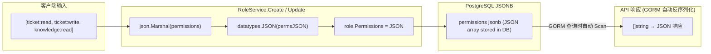
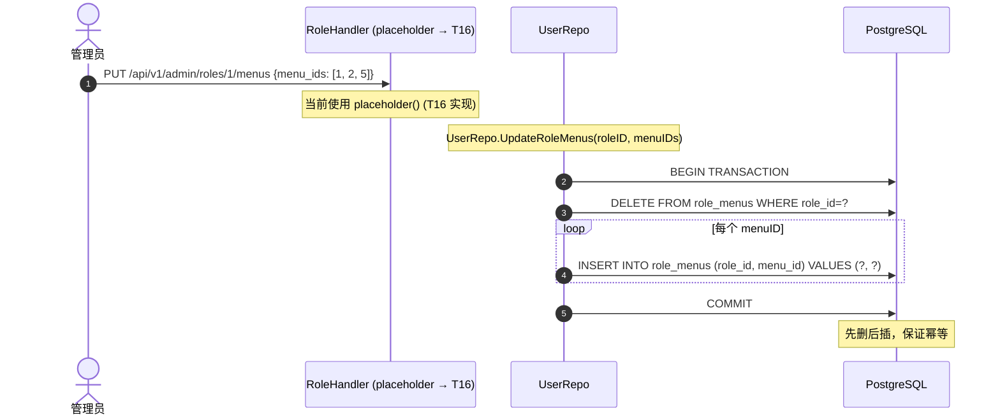
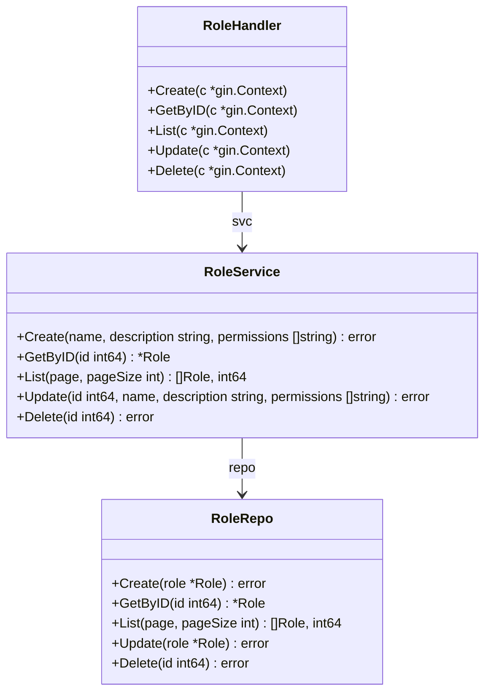

# 角色管理数据流 (Role CRUD Flow)

> **覆盖模块：** `handler/role.go` → `service/role_service.go` → `repository/role_repo.go`
> **对应任务：** T15（角色管理 Service + Handler）

---

## 1. 角色 CRUD 全流程

```mermaid
sequenceDiagram
    autonumber
    actor Admin as 管理员
    participant MW as JWTAuth + RequirePermission("user:manage")
    participant H as RoleHandler
    participant S as RoleService
    participant R as RoleRepo
    participant DB as PostgreSQL

    rect rgb(30, 40, 50)
        Note over Admin,DB: === 创建角色 POST /api/v1/admin/roles ===
        Admin->>MW: {name, description, permissions}
        MW->>H: RoleHandler.Create
        H->>H: c.ShouldBindJSON(&CreateRoleRequest)
        H->>S: Create(name, desc, perms)
        S->>DB: SELECT COUNT(*) FROM roles WHERE name=?
        alt 角色名已存在
            S-->>H: AppError{10005, "角色名已存在"}
        end
        S->>S: json.Marshal(permissions) → datatypes.JSON
        S->>R: Create(role)
        R->>DB: INSERT INTO roles (name, description, permissions) VALUES (...)
        S-->>H: nil → response.Success
        H-->>Admin: 200 {code:0}
    end

    rect rgb(40, 50, 60)
        Note over Admin,DB: === 获取详情 GET /api/v1/admin/roles/:id ===
        Admin->>MW: GET /roles/1
        MW->>H: RoleHandler.GetByID
        H->>H: strconv.ParseInt → roleID
        H->>S: GetByID(roleID)
        S->>R: GetByID(id)
        R->>DB: SELECT * FROM roles WHERE id=?
        DB-->>R: Role / gorm.ErrRecordNotFound
        alt 不存在
            S-->>H: AppError{10004, "角色不存在"}
        end
        S-->>H: *Role{ID, Name, Description, Permissions(JSONB)}
        H-->>Admin: 200 {code:0, data: Role}
    end

    rect rgb(50, 60, 70)
        Note over Admin,DB: === 列表 GET /api/v1/admin/roles?page=1&page_size=10 ===
        Admin->>MW: GET /roles?page=1&page_size=10
        MW->>H: RoleHandler.List
        H->>S: List(page, pageSize)
        S->>R: List(page, pageSize)
        R->>DB: SELECT COUNT(*) → SELECT * ORDER BY id DESC LIMIT ? OFFSET ?
        DB-->>R: []Role, total
        S-->>H: []Role, total
        H->>H: response.SuccessWithPage
        H-->>Admin: 200 {code:0, data:[...], total:N}
    end

    rect rgb(60, 70, 80)
        Note over Admin,DB: === 更新 PUT /api/v1/admin/roles/:id ===
        Admin->>MW: PUT /roles/1 {name, description, permissions}
        MW->>H: RoleHandler.Update
        H->>H: ParseInt(id) + c.ShouldBindJSON
        H->>S: Update(id, name, desc, perms)
        S->>R: GetByID(id)
        alt 不存在
            S-->>H: AppError{10004, "角色不存在"}
        end
        S->>S: json.Marshal(permissions) → 更新字段
        S->>R: Update(role)
        R->>DB: UPDATE roles SET name=?, description=?, permissions=? WHERE id=?
        S-->>H: nil
        H-->>Admin: 200 {code:0}
    end

    rect rgb(70, 80, 90)
        Note over Admin,DB: === 删除 DELETE /api/v1/admin/roles/:id ===
        Admin->>MW: DELETE /roles/1
        MW->>H: RoleHandler.Delete
        H->>H: ParseInt(id) → roleID
        H->>S: Delete(roleID)
        S->>R: GetByID(id)
        alt 不存在
            S-->>H: AppError{10004, "角色不存在"}
        end
        S->>R: Delete(id)
        R->>DB: DELETE FROM roles WHERE id=?
        S-->>H: nil
        H-->>Admin: 200 {code:0}
    end
```

---

## 2. Permissions JSONB 序列化流程

---

## 3. 角色-菜单绑定 (PUT /api/v1/admin/roles/:id/menus)

---

## 4. RoleRepo 方法总览

