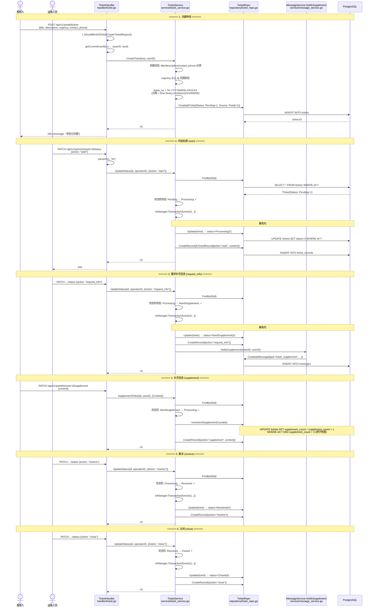
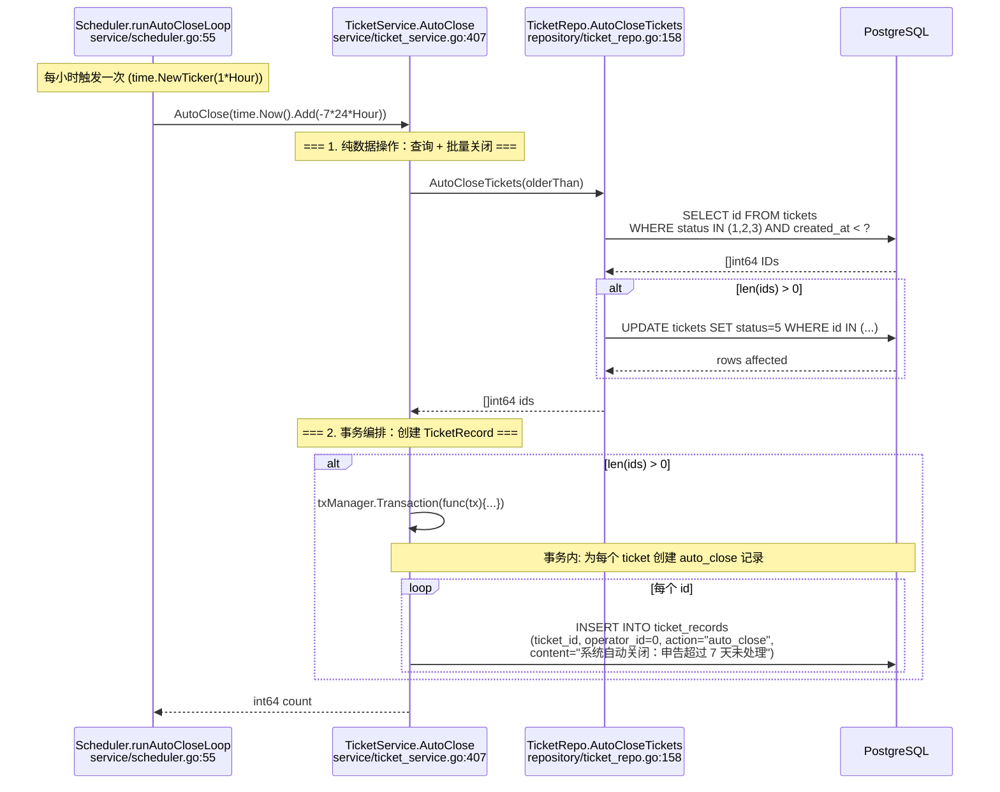
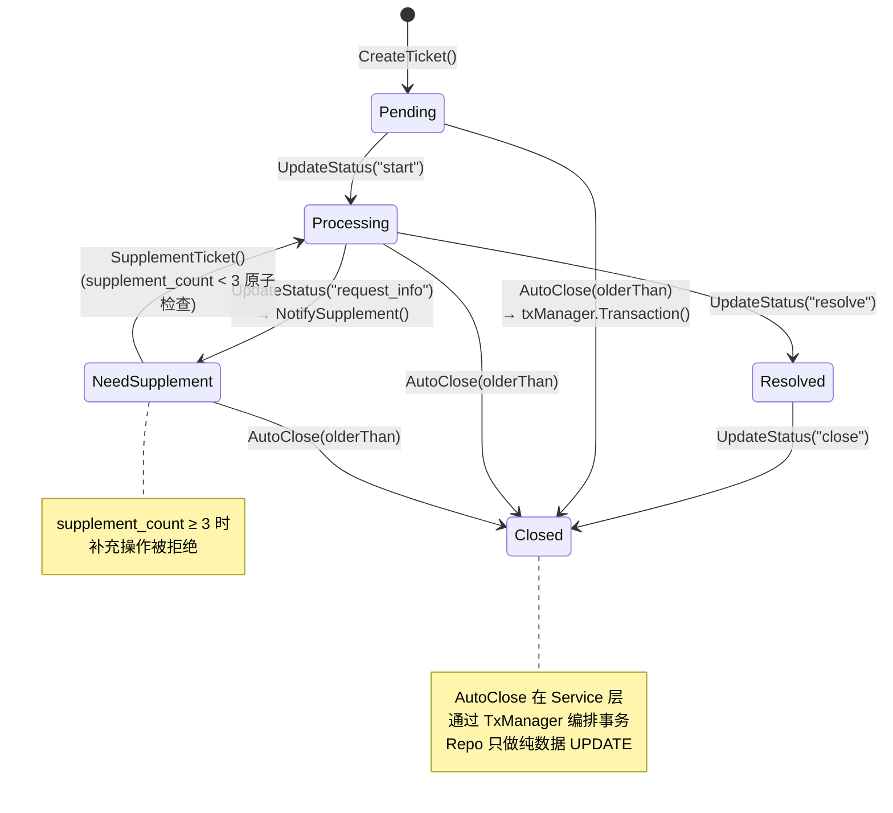

# 申告生命周期 v2 — 函数级调用链

> 代码基准：`handler/ticket.go` → `service/ticket_service.go` → `repository/ticket_repo.go` / `service/scheduler.go`
> 更新于 2026-06-12 — 反映 AutoClose 上移至 Service + TxManager 重构

## 1. 完整生命周期（创建→处理→关闭）

## 2. 自动关闭 (AutoClose) — Service 层编排

## 3. 状态机转换规则

