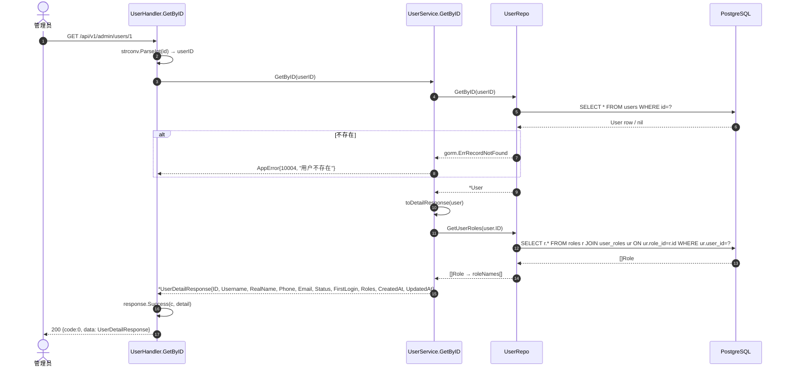
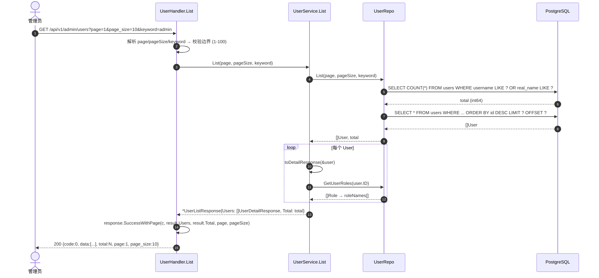
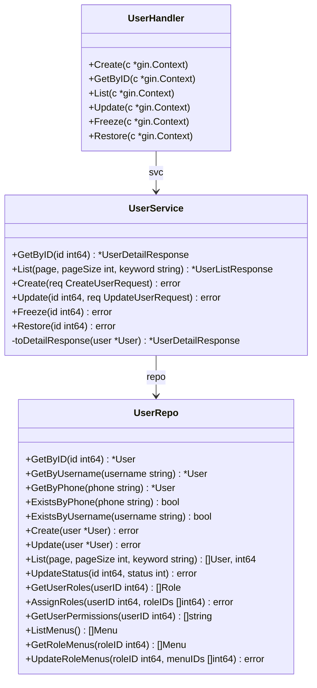

# 用户管理数据流 (User CRUD Flow)

> **覆盖模块：** `handler/user.go` → `service/user_service.go` → `repository/user_repo.go`
> **对应任务：** T14（用户管理 Service + Handler）、T10（用户 Repository）

---

## 1. 创建用户 (POST /api/v1/admin/users)

```mermaid
sequenceDiagram
    autonumber
    actor Admin as 管理员
    participant MW as JWTAuth + RequirePermission("user:manage")
    participant H as UserHandler.Create
    participant S as UserService.Create
    participant R as UserRepo
    participant Hash as pkg/hash
    participant DB as PostgreSQL

    Admin->>MW: POST /api/v1/admin/users {username, password, real_name, phone, email, role_ids}
    MW->>MW: JWT 解析 → 权限校验 → c.Next()
    MW->>H: c.Next()
    H->>H: c.ShouldBindJSON(&CreateUserRequest)
    H->>S: Create(req)

    rect rgb(40, 50, 60)
        Note over S: === UserService.Create ===
        S->>R: ExistsByUsername(req.Username)
        R->>DB: SELECT COUNT(*) FROM users WHERE username=?
        DB-->>R: count
        R-->>S: bool
        alt count > 0
            S-->>H: AppError{10005, "用户名已存在"}
        end

        S->>Hash: ValidatePassword(req.Password)
        Note over Hash: 正则: ^(?=.*[a-z])(?=.*[A-Z])(?=.*\d).{8,32}$
        alt 不符合策略
            S-->>H: AppError{10003, "密码不符合策略"}
        end

        S->>Hash: HashPassword(req.Password)
        Hash-->>S: bcrypt_hash (cost=10)

        S->>S: 构建 model.User{Username, PasswordHash, RealName, Phone, Email, Status=1, FirstLogin=true}
        S->>R: Create(user)
        R->>DB: INSERT INTO users (...) VALUES (...)
        DB-->>R: user.ID (auto_increment)
        R-->>S: nil

        opt len(req.RoleIDs) > 0
            S->>R: AssignRoles(user.ID, roleIDs)
            R->>DB: BEGIN → DELETE FROM user_roles WHERE user_id=? → INSERT user_roles → COMMIT
        end
    end

    S-->>H: nil (成功)
    H->>H: response.Success(c, nil)
    H-->>Admin: 200 {code:0}
```

---

## 2. 获取用户详情 (GET /api/v1/admin/users/:id)

---

## 3. 用户列表 (GET /api/v1/admin/users?page=1&page_size=10&keyword=)

---

## 4. 冻结/恢复用户 (PATCH /api/v1/admin/users/:id/freeze|unfreeze)

```mermaid
flowchart TD
    subgraph Freeze["UserHandler.Freeze → UserService.Freeze"]
        F1["c.Param('id') → ParseInt"] --> F2["svc.Freeze(id)"]
        F2 --> F3["repo.GetByID(id)"]
        F3 --> F4{user 存在?}
        F4 -->|否| F5["AppError{10004, '用户不存在'}"]
        F4 -->|是| F6{user.Status == 2?}
        F6 -->|是| F7["AppError{10006, '用户已被冻结'}"]
        F6 -->|否| F8["repo.UpdateStatus(id, 2)"]
        F8 --> F9["UPDATE users SET status=2 WHERE id=?"]
    end

    subgraph Restore["UserHandler.Restore → UserService.Restore"]
        R1["c.Param('id') → ParseInt"] --> R2["svc.Restore(id)"]
        R2 --> R3["repo.GetByID(id)"]
        R3 --> R4{user 存在?}
        R4 -->|否| R5["AppError{10004, '用户不存在'}"]
        R4 -->|是| R6{user.Status == 1?}
        R6 -->|是| R7["AppError{10007, '用户已处于正常状态'}"]
        R6 -->|否| R8["repo.UpdateStatus(id, 1)"]
        R8 --> R9["UPDATE users SET status=1 WHERE id=?"]
    end

    style F5 fill:#e74c3c,color:#fff
    style F7 fill:#e74c3c,color:#fff
    style R5 fill:#e74c3c,color:#fff
    style R7 fill:#e74c3c,color:#fff
    style F9 fill:#2ecc71,color:#fff
    style R9 fill:#2ecc71,color:#fff
```

---

## 5. 用户 Repository 方法总览

